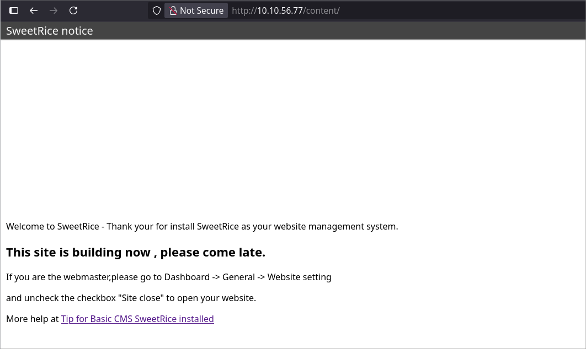
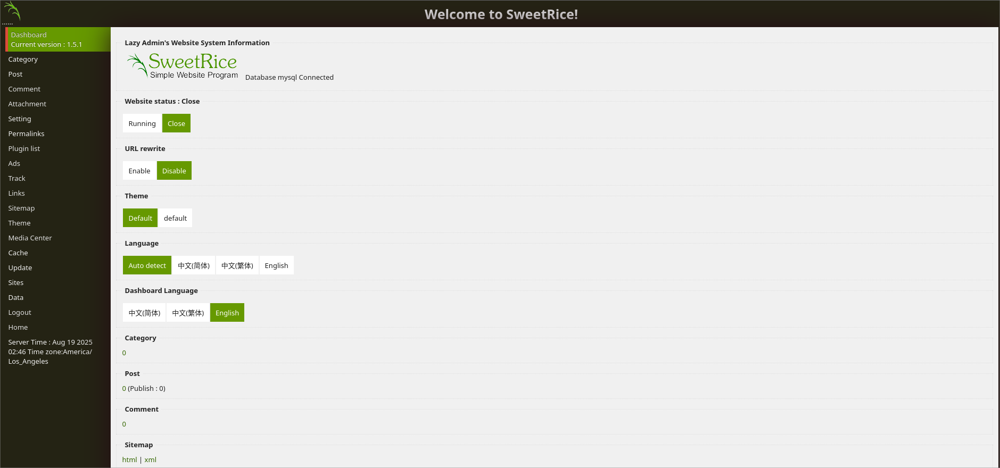
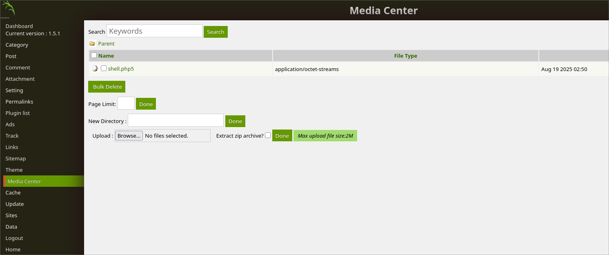
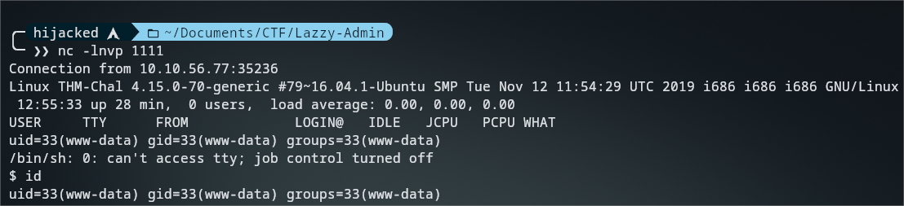
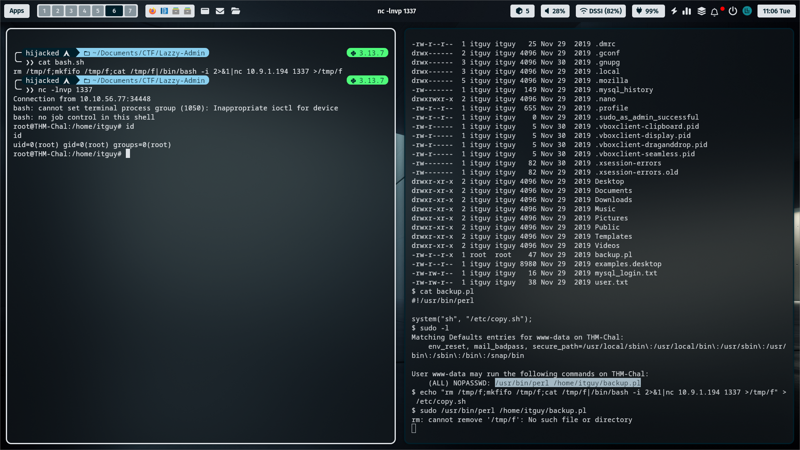

## Enumeration

```shell
 ❯❯ nmap -sCV 10.10.56.77
Starting Nmap 7.97 ( https://nmap.org ) at 2025-08-19 10:38 +0100
Nmap scan report for 10.10.56.77
Host is up (0.064s latency).
Not shown: 998 closed tcp ports (conn-refused)
PORT   STATE SERVICE VERSION
22/tcp open  ssh     OpenSSH 7.2p2 Ubuntu 4ubuntu2.8 (Ubuntu Linux; protocol 2.0)
| ssh-hostkey: 
|   2048 49:7c:f7:41:10:43:73:da:2c:e6:38:95:86:f8:e0:f0 (RSA)
|   256 2f:d7:c4:4c:e8:1b:5a:90:44:df:c0:63:8c:72:ae:55 (ECDSA)
|_  256 61:84:62:27:c6:c3:29:17:dd:27:45:9e:29:cb:90:5e (ED25519)
80/tcp open  http    Apache httpd 2.4.18 ((Ubuntu))
|_http-server-header: Apache/2.4.18 (Ubuntu)
|_http-title: Apache2 Ubuntu Default Page: It works
Service Info: OS: Linux; CPE: cpe:/o:linux:linux_kernel

Service detection performed. Please report any incorrect results at https://nmap.org/submit/ .
Nmap done: 1 IP address (1 host up) scanned in 11.67 seconds
```

> ##### The next step is to run a scan to find hidden files or directories using Dirsearch, with the following flags :

```shell
 ❯❯ dirsearch -u 10.10.56.77
  from pkg_resources import DistributionNotFound, VersionConflict

  _|. _ _  _  _  _ _|_    v0.4.3
 (_||| _) (/_(_|| (_| )

Extensions: php, aspx, jsp, html, js | HTTP method: GET | Threads: 25 | Wordlist size: 11460

Output File: /home/hijacked/Documents/CTF/Lazzy-Admin/reports/_10.10.56.77/_25-08-19_10-39-55.txt

Target: http://10.10.56.77/

[10:39:55] Starting: 
[10:40:02] 403 -  276B  - /.ht_wsr.txt
[10:40:02] 403 -  276B  - /.htaccess.bak1
[10:40:02] 403 -  276B  - /.htpasswds
[10:40:02] 403 -  276B  - /.htpasswd_test
[10:40:04] 403 -  276B  - /.php
[10:40:04] 403 -  276B  - /.php3
[10:40:23] 301 -  312B  - /content  ->  http://10.10.56.77/content/
[10:40:24] 200 -  984B  - /content/
```
> - Let’s check the page http://10.10.56.77/content →



## Exploitation

> - Next Step I search for folder `***inc***` , i find a files is "mysql_bakup_20191129023059-1.5.1.sql" has a user & password hash md5 .
> - After that i search for a login page "SweetRice", default path is `<IP>/as` but now nop `<IP>/content/as` .



> - Next Step & After long Searching About this App i found a path `/media_center` i can upload a reverse shell , so lets go !!!



> - Reverse Shell Generate by this Tool [DARK-SHELL](https://github.com/HIJACKED1/Dark-Shell-V1)
> - Now just open terminal & type `nc -lnvp <PORT>`



## Privilege Escalation

> - Now in `/home/itguy` i found this file runing as root name is `backup.pl` , i can put revershell in `/etc/copy.sh`
> - And Open my Netcat Port `1337`
> - Last Step use this command : `sudo /usr/bin/perl /home/itguy/backup.pl`



